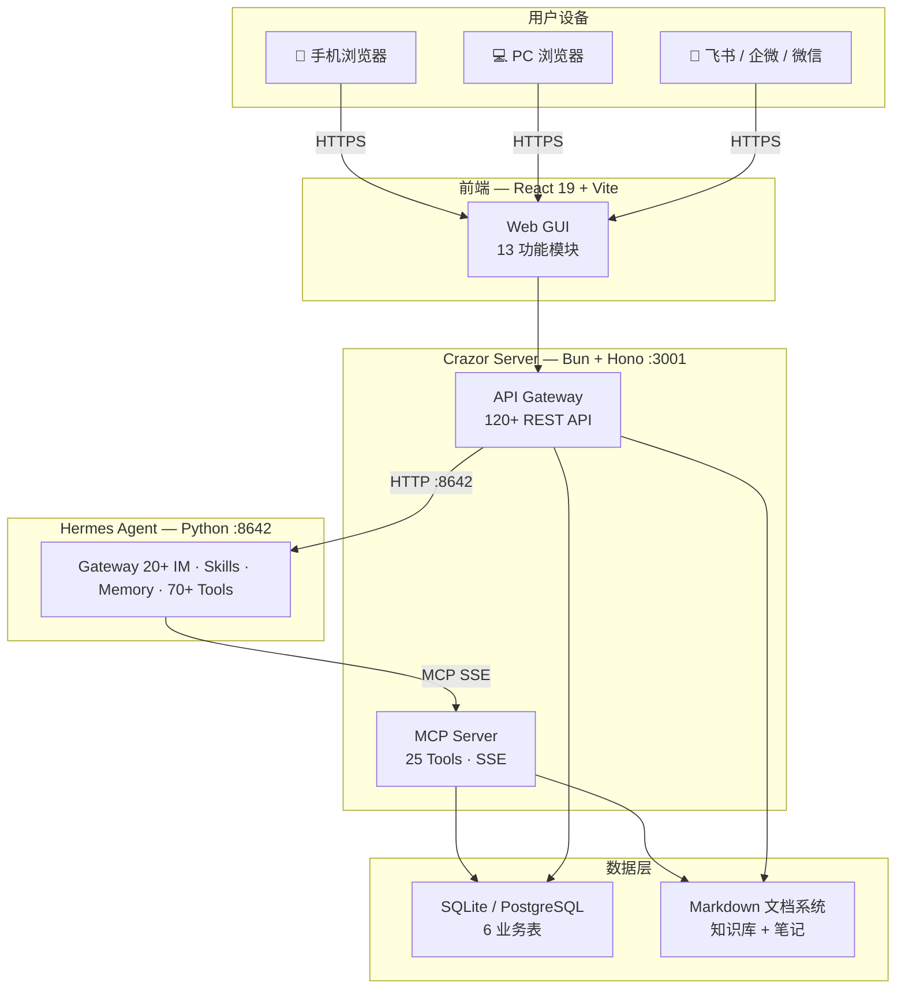
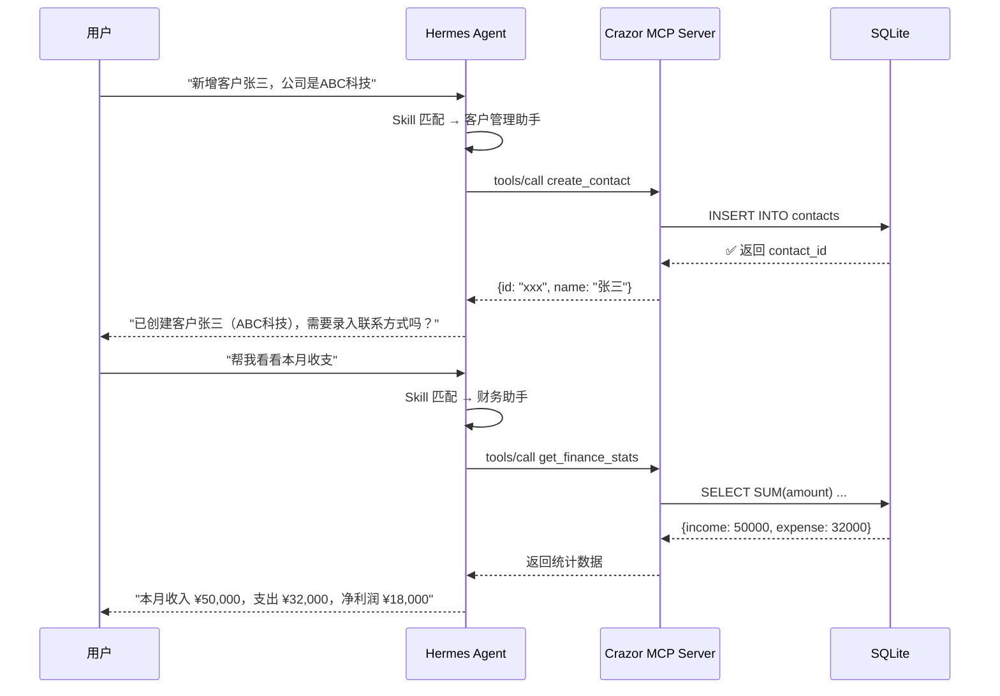
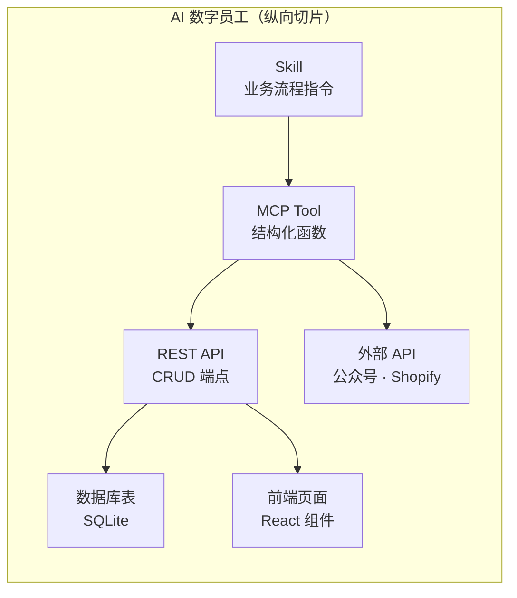

<div align="center">

# Crazor

### 企业 AI 操作系统

**让 AI 数字员工直接操作你的客户、财务、项目、文档**

[English](#english) · [功能](#功能) · [架构](#架构) · [快速开始](#快速开始) · [数字员工](#ai-数字员工)

</div>

---

## Crazor 是什么

Crazor 是一个开源的企业 AI 操作系统，核心思路：

**AI 数字员工 = Skill + MCP Tool + API + DB + 前端**，一个纵向切片从对话到数据到界面全部打通。

用户在聊天窗口说"新增一个客户张三"，AI 数字员工自动调用 MCP Tool 写入数据库，前端客户列表实时刷新。说"生成本周周报"，自动聚合客户、财务、项目数据并生成 Markdown 报告存入知识库。

底层 AI 能力（模型、Agent、Tool）可替换，企业工作流和数据永久保留。

### 为什么做这个

- 企业用 AI 最大的痛点不是模型不够强，而是 **AI 无法直接操作业务系统**
- 现有的 AI 助手只能聊天，不能帮你录入客户、管理库存、生成报表
- SaaS 平台各自封闭（Google AI 只能用 Google 数据，Salesforce AI 只管 Salesforce）
- 换一个 AI 模型或 Agent，之前搭建的工作流全部作废

Crazor 的解法：自建 MCP Server 统一数据层，AI 数字员工通过标准化接口操作企业数据，与底层模型和 Agent 完全解耦。

---

## 功能

### AI Workspace

| 模块 | 说明 |
|------|------|
| **首页仪表盘** | 今日待办、快捷操作、数据概览、最近会话 |
| **AI 对话** | 流式输出、工具调用可视化、多模型切换、会话历史 |
| **AI 数字员工** | 浏览 10+ 数字员工、查看架构详情（MCP/API/DB）、一键安装 |
| **技能清单** | Hermes 技能市场、安装/卸载/更新、多来源（官方/社区/GitHub） |
| **定时任务** | Cron 定时执行 AI 任务、执行日志查看、依赖管理 |
| **Agent 管理** | Hermes 状态监控、配置编辑、内置终端 |

### Enterprise Workspace

| 模块 | 说明 |
|------|------|
| **客户管理** | 联系人 CRUD、客户分层（线索→成交）、跟进时间线、标签体系 |
| **财务中心** | 收支记录、分类统计、月度汇总图表、发票状态追踪 |
| **项目看板** | 看板视图拖拽、任务分解、优先级/截止日期、团队分配 |
| **知识库** | 文档树管理、Markdown 编辑、全文搜索、文件夹组织 |
| **AI 笔记** | Milkdown WYSIWYG 编辑器、碎片化笔记 (Beta) |
| **数据分析** | 客户/财务/项目多维度聚合、趋势图表 |
| **文件管理** | 文件浏览器、预览、编辑、附件上传 |

### 系统能力

- **多模型切换** — 支持 OpenAI / Claude / Gemini / DeepSeek / Ollama 等 18+ provider
- **20+ IM 接入** — 飞书、企微、微信、WhatsApp、Telegram、Discord、Slack 等
- **MCP 生态** — 通过 MCP 协议连接任意外部服务
- **国际化** — 简体中文、繁体中文、English
- **响应式** — 手机/平板/PC 自适应布局

---

## 架构

### 系统架构



### 数据流



---

## AI 数字员工

每个数字员工是一个纵向切片，从 Skill 到前端全链路打通：



### 已实现的数字员工

| 数字员工 | 能力 | Skill 工作流 | MCP Tools | 数据表 |
|----------|------|-------------|-----------|--------|
| **客户管理助手** | 管理客户全生命周期 | 线索→跟进→意向→成交/流失，自动分层、跟进提醒 | create/update/list/get_contact, get_contacts_stats, list_notes_by_contact | contacts |
| **财务助手** | 收支记录、发票、报表 | 录入收支→分类→发票管理→月度汇总→报表生成 | create/update/list_transaction, get_finance_stats | transactions |
| **项目助手** | 项目创建、任务管理 | 创建项目→分解任务→看板跟踪→里程碑管理 | create/update_project, create/update/move/list_task, get_projects_stats | projects, tasks |
| **素材提炼助手** | 原始素材→知识卡片 | 读取原始素材→提取要点→生成结构化卡片→归档 | create/update/read_doc, search_docs, read_vault_file | doc_notes |
| **内容生产助手** | 多平台内容创作 | 选题→创作→排版→适配各平台→发布 | create/update_doc, read_vault_file | doc_notes |
| **朋友圈运营助手** | 朋友圈排期与数据周报 | 内容规划→排期→发布记录→数据复盘→周报 | create/update_doc, search_docs | doc_notes |
| **人事助手** | 员工档案、考勤、绩效 | 入职建档→考勤记录→绩效评估→薪资管理→离职 | create/update/read_doc, search_docs | doc_notes |
| **库存助手** | SKU、订单、库存预警 | 注册SKU→订单处理→出入库→库存预警→补货 | create/update/read_doc, search_docs | doc_notes |
| **数据看板** | 周报/月报/KPI 追踪 | 采集数据→环比分析→生成报告→存档→追踪KPI | get_*_stats, list_*, create_doc | 读取全部表 |
| **系统规范** | 知识库操作规范 | Vault 文件管理规范、数据操作准则 | read_vault_file | — |

### 数字员工怎么工作

以"客户管理助手"为例：

```
用户说："新增客户张三，ABC科技公司，来源是抖音"

1. Hermes Agent 匹配到"客户管理助手"Skill
2. Agent 调用 MCP Tool: create_contact({name:"张三", company:"ABC科技", source:"抖音"})
3. Crazor MCP Server 接收请求 → 路由到内部 API → 写入 SQLite contacts 表
4. 返回结果给 Agent
5. Agent 回复用户："已创建客户张三，当前阶段：新线索"
6. 前端客户列表页面自动刷新显示新客户
```

---

## 技术栈

| 层 | 技术 | 说明 |
|----|------|------|
| **前端框架** | React 19 + Vite 8 | SPA 单页应用 |
| **UI 组件** | shadcn/ui + Radix UI | 可定制组件库 |
| **样式** | Tailwind CSS 4 | 原子化 CSS |
| **Markdown 编辑器** | Milkdown | WYSIWYG，支持数学/代码/Mermaid |
| **图表** | Recharts + Mermaid | 数据可视化 |
| **终端** | xterm.js | 内置终端模拟器 |
| **后端** | Bun + Hono | 高性能 TypeScript 运行时 |
| **MCP Server** | SSE + JSON-RPC 2.0 | 内嵌于后端进程，零额外开销 |
| **AI Agent** | Hermes Agent (Python) | 多模型、20+ IM、70+ 内置工具 |
| **数据库** | SQLite (开发) / PostgreSQL (生产) | 6 张业务表 |
| **文档存储** | Markdown 文件系统 | 知识库 + 笔记 |
| **国际化** | react-i18next | 中文 / English / 繁体中文 |

---

## 项目结构

```
Crazor/
├── server/                         # 后端 (Bun + Hono + TypeScript)
│   ├── src/
│   │   ├── index.ts                # 入口：120+ API 路由 + MCP SSE endpoint
│   │   └── services/
│   │       ├── crazor-db.ts        # 数据库层：6 表 Schema + CRUD + 聚合统计
│   │       ├── crazor-mcp.ts       # MCP Server：25 Tools + SSE 传输协议
│   │       ├── crazor-doc-tree.ts  # 文档树：文件夹 + 笔记管理
│   │       ├── crazor-docs.ts      # 文档读写：内容搜索、附件关联
│   │       ├── skill-catalog.ts    # 技能目录：frontmatter 解析、元数据 API
│   │       └── seed-vault.ts       # 种子数据：初始化知识库结构
│   └── data/
│       ├── skills/                 # 10 个 Skill 定义（.md + YAML frontmatter）
│       │   ├── 客户管理助手.md
│       │   ├── finance.md
│       │   ├── project.md
│       │   └── ...
│       └── vault/                  # 知识库静态文件（参考模板等）
│
├── web/                            # 前端 (React 19 + Vite 8)
│   └── src/
│       ├── AppInner.jsx            # 主应用 Shell：侧边栏 + 路由 + 13 个视图
│       ├── App.jsx                 # 根组件
│       ├── api/                    # 19 个 API 客户端模块
│       │   ├── chat.js             # 对话 API
│       │   ├── session.js          # 会话管理
│       │   ├── skills.js           # 技能市场
│       │   └── ...
│       ├── components/
│       │   ├── hermes/             # AI 数字员工管理页 + 技能清单页
│       │   ├── notebook/           # Milkdown 笔记编辑器组件
│       │   ├── layout/             # 布局组件（侧边栏、头部等）
│       │   └── ui/                 # shadcn/ui 基础组件
│       ├── locales/                # 国际化文件（zh / en / zh-tw）
│       ├── ContactsView.jsx        # 客户管理页
│       ├── FinanceView.jsx         # 财务中心页
│       ├── ProjectsView.jsx        # 项目看板页
│       ├── HomeView.jsx            # 首页仪表盘
│       ├── SessionsView.jsx        # 对话列表页
│       ├── CronView.jsx            # 定时任务页
│       └── ...                     # 其他视图组件
│
└── docker/                         # 部署配置（规划中）
```

---

## MCP Server

Crazor 内嵌 MCP Server，通过 SSE 暴露给 Hermes Agent。无需启动额外进程。

### 25 个 MCP Tools

**数据库操作（17）：**

| 类别 | Tools | 说明 |
|------|-------|------|
| **客户** | `create_contact` `update_contact` `list_contacts` `get_contact` `get_contacts_stats` | CRUD + 统计聚合 |
| **财务** | `create_transaction` `update_transaction` `list_transactions` `get_finance_stats` | 收支记录 + 财务统计 |
| **项目** | `create_project` `update_project` `list_projects` `get_projects_stats` | 项目管理 + 统计 |
| **任务** | `create_task` `update_task` `move_task` `list_tasks` | 看板任务 + 拖拽排序 |

**文档操作（8）：**

| Tool | 说明 |
|------|------|
| `create_doc` | 创建文档（支持关联客户） |
| `update_doc` | 更新文档标题和内容 |
| `read_doc` | 读取文档详情和内容 |
| `list_docs` | 列出文件夹下的文档 |
| `search_docs` | 全文搜索文档 |
| `create_folder` | 创建文件夹 |
| `read_vault_file` | 读取知识库静态文件 |
| `list_notes_by_contact` | 查询客户关联的所有文档 |

---

## 数据库

6 张业务表：

| 表 | 用途 | 关键字段 |
|----|------|----------|
| `contacts` | 客户 CRM | name, company, stage(线索/意向/成交), source, level, deal, tags |
| `transactions` | 收支记录 | type(收入/支出), amount, category, invoice_number, tax_amount |
| `projects` | 项目管理 | name, status, budget, deadline, team, contact_id |
| `tasks` | 看板任务 | title, priority, status, assignee, due_date, estimated_hours |
| `doc_folders` | 文档目录 | scope, parent_id, contact_id (支持关联客户) |
| `doc_notes` | 文档笔记 | scope, folder_id, title, contact_id |

---

## 快速开始

### 前置条件

| 依赖 | 版本 | 安装 |
|------|------|------|
| [Bun](https://bun.sh) | >= 1.0 | `curl -fsSL https://bun.sh/install \| bash` |
| [Node.js](https://nodejs.org) | >= 18 | `nvm install 18` |
| [Hermes Agent](https://github.com/nicepkg/hermes) | >= 0.14 | `pip install hermes-agent` |

### 数据目录

Crazor 的数据独立存储，与 Hermes 完全解耦：

```
~/.crazor/
├── crazor.db          # 业务数据库（contacts, transactions, projects, tasks, docs）
├── docs/              # 知识库文档（Markdown 文件）
└── skills/            # 已安装的技能
```

默认路径 `~/.crazor/`，可通过环境变量覆盖：

```bash
export CRAZOR_HOME=/path/to/custom/dir
```

首次启动时，如果检测到旧数据在 `~/.hermes/` 下，会打印迁移提示。

### 1. 启动 Hermes Agent

```bash
hermes start
# Agent 运行在 http://localhost:8642
```

### 2. 启动 Crazor Server

```bash
cd server
bun install
bun run dev
# Server 运行在 http://localhost:3001
# MCP endpoint: http://localhost:3001/mcp/sse

# 如果之前数据在 ~/.hermes/ 下，首次启动会提示迁移命令：
# cp ~/.hermes/crazor.db ~/.crazor/crazor.db
# cp -r ~/.hermes/crazor-docs ~/.crazor/docs
```

### 3. 启动前端

```bash
cd web
npm install
npm run dev
# 前端运行在 http://localhost:5173
```

### 4. 注册 MCP Server

```bash
hermes mcp add crazor --url http://localhost:3001/mcp/sse --transport sse
hermes mcp test crazor  # 验证连接，应返回 25 tools
```

### 5. 开始使用

打开 http://localhost:5173，在对话窗口试试：

- "帮我新增一个客户李四，公司是XYZ科技"
- "看看本月收入多少"
- "创建一个新项目叫海外推广"
- "生成本周周报"

---

## 开发新的数字员工

1. **定义数据库表** — 在 `server/src/services/crazor-db.ts` 添加 CREATE TABLE
2. **实现 REST API** — 在 `server/src/index.ts` 添加 CRUD 路由
3. **注册 MCP Tool** — 在 `server/src/services/crazor-mcp.ts` 添加 tool 定义和 handler
4. **编写 Skill** — 在 `server/data/skills/` 创建 `新助手.md`（含 YAML frontmatter）
5. **更新目录** — 在 `server/src/services/skill-catalog.ts` CATALOG 数组添加条目
6. **开发前端页面** — 在 `web/src/` 创建 React 视图组件

---

## 路线图

- [x] **Phase 1** — MVP：对话 + MCP Server + 数字员工 + 企业数据模块
- [ ] **Phase 2** — IM Hub（飞书/企微绑定）、技能市场、AI 辅助写作
- [ ] **Phase 3** — 3D 虚拟办公室、连接器商店（Gmail/Shopify/小红书）
- [ ] **Phase 4** — 多租户、团队协作、权限管理
- [ ] **Phase 5** — Tauri 桌面客户端、离线模式

---

## License

MIT
