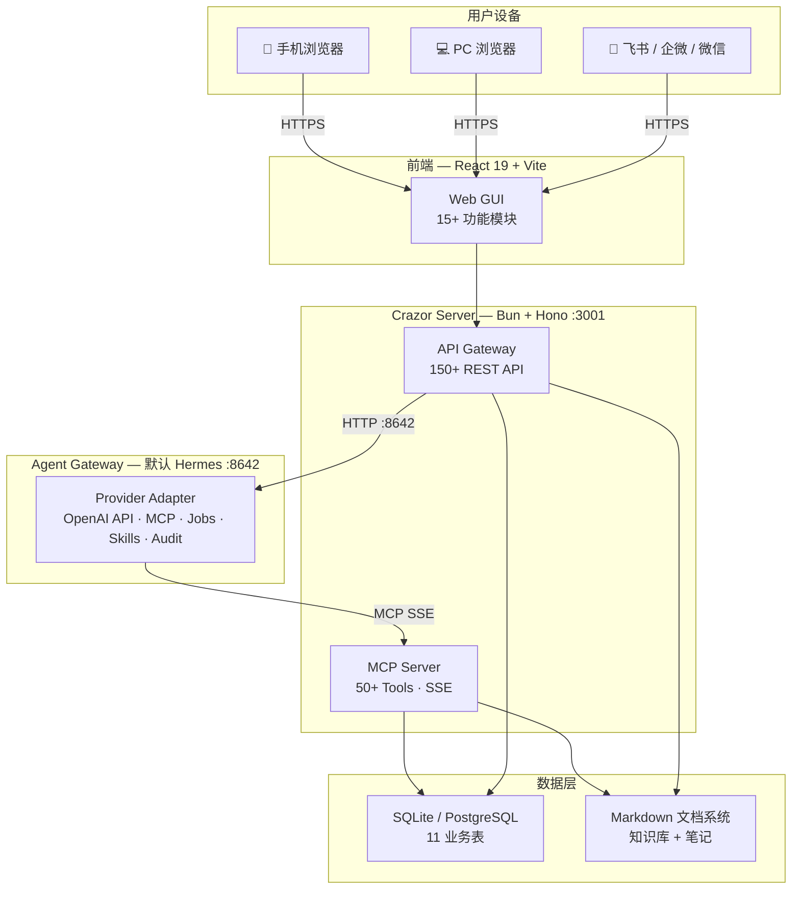

<div align="center">

# Crazor

### 企业 AI 操作系统

**让 AI 数字员工直接操作你的客户、财务、项目、文档**

[功能](#功能) · [架构](#架构) · [快速开始](#快速开始) · [数字员工](#ai-数字员工)

</div>

---

## 项目协作入口

- [Docker 部署说明](docs/deployment/docker.md)
- [Hermes Agent 集成说明](docs/deployment/hermes-agent.md)
- [Agent Gateway 解耦规范](docs/architecture/agent-gateway.md)
- [分支与多人协作规范](docs/development/branching-and-collaboration.md)
- [产品持续审计入口](docs/audit/README.md)

## Crazor 是什么

Crazor 是一个开源的企业 AI 操作系统，核心思路：

**AI 数字员工 = Skill + MCP Tool + API + DB + 前端**，一个纵向切片从对话到数据到界面全部打通。

用户在聊天窗口说"新增一个客户张三"，AI 数字员工自动调用 MCP Tool 写入数据库，前端客户列表实时刷新。说"生成本周周报"，自动聚合客户、财务、项目数据并生成 Markdown 报告存入知识库。

底层 AI 能力（模型、Agent、Tool）可替换，企业工作流和数据永久保留。

### 为什么做这个

- 企业用 AI 最大的痛点不是模型不够强，而是 **AI 无法直接操作业务系统**
- 现有的 AI 助手只能聊天，不能帮你录入客户、管理库存、生成报表
- SaaS 平台各自封闭（Google AI 只能用 Google 数据，Salesforce AI 只管 Salesforce）
- 换一个 AI 模型或 Agent，之前搭建的工作流全部作废

Crazor 的解法：自建 MCP Server 统一数据层，AI 数字员工通过标准化接口操作企业数据，与底层模型和 Agent 完全解耦。

---

## 功能

### AI Workspace

| 模块 | 说明 |
|------|------|
| **首页仪表盘** | 今日待办、快捷操作、数据概览、最近会话 |
| **AI 对话** | 流式输出、工具调用可视化、多模型切换、会话历史 |
| **AI 数字员工** | 浏览 21 个数字员工、查看架构详情（MCP/API/DB）、一键安装 |
| **技能清单** | Hermes 技能市场、安装/卸载/更新、多来源（官方/社区/GitHub） |
| **定时任务** | Cron 定时执行 AI 任务、执行日志查看、依赖管理 |
| **消息渠道** | 飞书、企微、微信、WhatsApp、Telegram、Discord、Slack 等 20+ IM |
| **模型配置** | 多模型切换、API Key 管理、辅助模型分配 |
| **Agent 管理** | Hermes 状态监控、配置编辑、内置终端 |

### Enterprise Workspace

| 模块 | 说明 |
|------|------|
| **客户管理** | 联系人 CRUD、客户分层（线索→成交）、跟进时间线、标签体系 |
| **财务中心** | 收支记录、分类统计、月度汇总图表、发票状态追踪 |
| **项目看板** | 看板视图拖拽、任务分解、优先级/截止日期、团队分配 |
| **平台流量** | 内容作品状态追踪、12 个平台筛选、数据回收、看板管理 |
| **知识库** | 文件系统驱动的文档树、Markdown 编辑、全文搜索、Obsidian 兼容 |
| **AI 笔记** | Milkdown WYSIWYG 编辑器、碎片化笔记、聊天消息保存 |
| **数据分析** | 客户/财务/项目多维度聚合、趋势图表 |
| **文件管理** | 文件浏览器、预览、编辑、附件上传 |
| **3D 办公室** | 2.5D 像素风虚拟办公室、员工角色管理 |

### 系统能力

- **多模型切换** — 支持 OpenAI / Claude / Gemini / DeepSeek / GLM / Ollama 等 18+ provider
- **20+ IM 接入** — 飞书、企微、微信、WhatsApp、Telegram、Discord、Slack 等
- **MCP 生态** — 通过 MCP 协议连接任意外部服务（内嵌 50+ Tools）
- **国际化** — 简体中文、English
- **响应式** — 手机/平板/PC 自适应布局

---

## 架构

### 系统架构



### 数据流

```
用户说："新增客户张三，公司是ABC科技"

1. 前端 → Crazor Server → Hermes Gateway API (:8642)
2. Hermes Agent 匹配到"客户管理助手"Skill
3. Agent 调用 MCP Tool: create_contact({name:"张三", company:"ABC科技"})
4. Crazor MCP Server → 写入 SQLite contacts 表
5. 返回结果 → Agent 回复用户
6. 前端客户列表页面自动刷新
```

---

## AI 数字员工

每个数字员工是一个纵向切片，从 Skill 到前端全链路打通：

```
Skill(业务流程指令) → MCP Tool(结构化函数) → REST API(CRUD) → 数据库 → 前端页面
```

### 已实现的数字员工（21 个）

| 数字员工 | 能力 |
|----------|------|
| **客户管理助手** | 线索→跟进→意向→成交/流失，自动分层、跟进提醒 |
| **销售跟进助手** | 销售漏斗管理、成交记录、月度业绩报表 |
| **财务助手** | 收支记录、发票管理、月度汇总、报表生成 |
| **项目助手** | 项目创建、任务分解、看板跟踪、里程碑管理 |
| **内容生产助手** | 多平台内容创作、选题→创作→排版→发布 |
| **素材提炼助手** | 原始素材提取要点、生成结构化知识卡片 |
| **选题排期助手** | 内容日历规划、选题池管理、排期追踪 |
| **朋友圈运营助手** | 朋友圈排期、发布记录、数据复盘、周报 |
| **公众号发布助手** | 公众号内容管理、排版、发布流程 |
| **小红书运营助手** | 小红书内容创作、数据追踪 |
| **人事助手** | 员工档案、考勤、绩效、薪资管理 |
| **库存助手** | SKU 管理、出入库、库存预警 |
| **数据看板** | 周报/月报/KPI 追踪、环比分析 |
| **AI 新闻分析师** | AI 行业新闻追踪、分析报告 |
| **YouTube 运营** | YouTube 内容创作与数据分析 |
| **Twitter 运营** | Twitter 内容发布与互动管理 |
| **Instagram 运营** | Instagram 内容创作与数据分析 |
| **Amazon 运营** | Amazon 跨境电商运营管理 |
| **TikTok 海外运营** | TikTok 海外内容创作与数据追踪 |
| **Shopify 运营** | Shopify 独立站运营管理 |
| **跨境物流助手** | 跨境电商物流管理 |

---

## 技术栈

| 层 | 技术 | 说明 |
|----|------|------|
| **前端框架** | React 19 + Vite 8 | SPA 单页应用 |
| **UI 组件** | shadcn/ui + Radix UI | 可定制组件库 |
| **样式** | Tailwind CSS 4 | 原子化 CSS |
| **Markdown 编辑器** | Milkdown | WYSIWYG，支持数学/代码/Mermaid |
| **图表** | Recharts + Mermaid | 数据可视化 |
| **终端** | xterm.js | 内置终端模拟器 |
| **后端** | Bun + Hono | 高性能 TypeScript 运行时 |
| **MCP Server** | SSE + JSON-RPC 2.0 | 内嵌于后端进程，零额外开销 |
| **AI Agent** | Agent Gateway（默认 Hermes Provider） | 多模型、MCP、技能、记忆、定时任务，可替换 provider |
| **数据库** | SQLite (开发) / PostgreSQL (生产) | 11 张业务表 |
| **文档存储** | Markdown 文件系统 | Obsidian 兼容，数字前缀排序 |
| **国际化** | react-i18next | 中文 / English |

---

## 项目结构

```
Crazor/
├── server/                         # 后端 (Bun + Hono + TypeScript)
│   ├── src/
│   │   ├── index.ts                # 入口：150+ API 路由 + MCP SSE endpoint
│   │   └── services/
│   │       ├── crazor-db.ts        # 数据库层：11 表 Schema + CRUD + 聚合统计
│   │       ├── crazor-mcp.ts       # MCP Server：50+ Tools + SSE 传输协议
│   │       ├── crazor-doc-tree.ts  # 文档树：文件夹 + 笔记管理（文件系统）
│   │       ├── crazor-docs.ts      # 文档读写：内容搜索、附件关联
│   │       ├── crazor-vault-fs.ts  # Vault 文件系统操作
│   │       ├── crazor-config.ts    # 配置：路径、环境变量
│   │       ├── skill-catalog.ts    # 技能目录：frontmatter 解析、元数据 API
│   │       ├── seed-vault.ts       # 种子数据：初始化知识库目录结构
│   │       ├── migrate-vault.ts    # 迁移：目录重命名（数字前缀）
│   │       └── field-definitions.ts # 自定义字段定义管理
│   └── data/
│       ├── skills/                 # 21 个 Skill 定义（.md + YAML frontmatter）
│       └── vault/                  # 知识库模板和种子数据
│
├── web/                            # 前端 (React 19 + Vite 8)
│   └── src/
│       ├── AppInner.jsx            # 主应用 Shell：侧边栏 + 路由 + 15+ 视图
│       ├── api/                    # API 客户端模块
│       ├── components/
│       │   ├── hermes/             # AI 数字员工管理 + 渠道配置
│       │   ├── office/             # 2.5D 像素风虚拟办公室引擎
│       │   ├── notebook/           # Milkdown 笔记编辑器组件
│       │   ├── data-view/          # 通用数据视图组件（表格+看板+详情）
│       │   ├── layout/             # 布局组件
│       │   └── ui/                 # shadcn/ui 基础组件
│       ├── configs/                # 数据视图配置（CRM、财务、项目、内容等）
│       └── locales/                # 国际化文件（zh / en）
│
├── docker/                         # Docker 镜像与 nginx 反向代理配置
├── docker-compose.yml              # Crazor + 默认 Agent Provider 本地集成部署
├── scripts/hermes                  # Hermes 初始化、启动、备份与密钥轮换脚本
└── docs/                           # 产品文档、部署与协作规范
```

---

## MCP Server

Crazor 内嵌 MCP Server，通过 SSE 暴露给 Hermes Agent。无需启动额外进程。

### 50+ MCP Tools

**数据库操作（联系人/CRM）：**

| Tools | 说明 |
|-------|------|
| `create/update/list/get/delete_contact` | 联系人 CRUD |
| `get_contacts_stats` | 客户统计聚合 |
| `create/update/list/delete_follow_up` | 跟进记录管理 |
| `get_follow_up_reminders` | 跟进提醒 |

**数据库操作（财务）：**

| Tools | 说明 |
|-------|------|
| `create/update/list/delete_transaction` | 收支记录 CRUD |
| `get_finance_stats` | 财务统计（月度/分类） |

**数据库操作（项目/任务）：**

| Tools | 说明 |
|-------|------|
| `create/update/list/delete_project` | 项目 CRUD |
| `create/update/list/delete_task` | 任务 CRUD |
| `move_task` | 看板拖拽排序 |

**数据库操作（渠道/内容）：**

| Tools | 说明 |
|-------|------|
| `create/update/list/get/delete_channel` | 渠道管理 |
| `get_channel_stats` | 渠道统计 |
| `create/update/list/get/delete_content_piece` | 内容作品 CRUD |
| `getContentPieceStats` | 内容数据统计 |

**文档操作：**

| Tools | 说明 |
|-------|------|
| `create_doc` / `update_doc` / `read_doc` | 文档 CRUD |
| `list_docs` / `search_docs` | 文档列表和全文搜索 |
| `create_folder` / `rename_folder` / `delete_folder` | 文件夹管理 |
| `read_vault_file` | 读取知识库文件 |
| `list_notes_by_contact` | 按联系人查询文档 |

**Schema 操作：**

| Tools | 说明 |
|-------|------|
| `list/discover/create/update/delete_field_definitions` | 自定义字段管理 |

---

## 数据库

11 张业务表：

| 表 | 用途 |
|----|------|
| `contacts` | 客户 CRM（name, company, stage, source, level, deal, tags） |
| `transactions` | 收支记录（type, amount, category, invoice_number） |
| `projects` | 项目管理（name, status, budget, deadline, team） |
| `tasks` | 看板任务（title, priority, status, assignee, due_date） |
| `follow_ups` | 跟进记录（contact_id, content, follow_up_date） |
| `channels` | 渠道管理（name, type, status, contact_id） |
| `channel_referrals` | 渠道引荐记录 |
| `content_pieces` | 内容作品（title, platform, status, views, likes） |
| `doc_folders` | 文档目录（scope, parent_id, contact_id） |
| `doc_notes` | 文档笔记（scope, folder_id, title） |
| `field_definitions` | 自定义字段定义 |

---

## 快速开始

### 推荐方式：Docker Compose

| 依赖 | 版本 | 安装 |
|------|------|------|
| Docker / OrbStack | 当前可用版本 | macOS 推荐 OrbStack |

初始化 Hermes 密钥和相对数据目录：

```bash
./scripts/hermes init
```

启动统一入口：

```bash
docker compose up -d --build
```

访问：

```text
http://localhost:5173
http://局域网IP:5173
```

运行交付烟测：

```bash
./scripts/hermes smoke
```

烟测会创建临时客户、文档、附件、渠道、流水、项目、任务、内容和 token，验证后自动清理。需要验证局域网入口时可指定：

```bash
CRAZOR_SMOKE_BASE_URL=http://局域网IP:5173 ./scripts/hermes smoke
```

Docker 环境会启动：

- `crazor-web`：Web 统一入口，反代 `/api/*` 和 `/mcp/*`。
- `crazor-server`：Bun + Hono 后端，提供业务 API 与 MCP SSE。
- `hermes`：默认 Agent Provider，提供 Agent、模型、技能、记忆和定时任务能力，可通过 `COMPOSE_PROFILES` 解耦。

运行数据统一保存到项目相对目录：

```text
./data/crazor/
./data/hermes/
```

默认不会写入 mock-data：

```env
CRAZOR_SEED_DEMO_DATA=false
```

需要强制所有业务写入都带可审计身份时开启：

```env
CRAZOR_REQUIRE_WRITE_TOKEN=true
```

开启后，先在“协作审计”里创建身份并签发带 scope 的 API/Agent token，再在“当前访问 Token”里启用；REST 与 MCP 写入会按 token scope 校验，越权动作会进入审计日志。敏感只读接口默认跟随该开关，已有 active token 后，审计日志、成员列表和 token 列表也必须携带有权限的 token。

完整说明见 [Docker 部署说明](docs/deployment/docker.md) 和 [Hermes Agent 集成说明](docs/deployment/hermes-agent.md)。

### 本地开发方式

本地开发才需要直接安装 Bun、Node.js 和 Hermes CLI。

```bash
hermes gateway
cd server
bun install
bun run dev
# Server 运行在 http://localhost:3001
# MCP endpoint: http://localhost:3001/mcp/sse
cd web
npm install
npm run dev
```

本地开发的 MCP 注册地址：

```bash
# 在 ~/.hermes/config.yaml 中添加：
#   mcp_servers:
#     crazor:
#       url: "http://localhost:3001/mcp/sse"
#       transport: sse
#       enabled: true

hermes mcp test crazor  # 验证连接
```

### 开始使用

打开 http://localhost:5173，在对话窗口试试：

- "帮我新增一个客户李四，公司是XYZ科技"
- "看看本月收入多少"
- "创建一个新项目叫海外推广"
- "生成本周周报"

---

## 开发新的数字员工

1. **定义数据库表** — 在 `server/src/services/crazor-db.ts` 添加 CREATE TABLE
2. **实现 REST API** — 在 `server/src/index.ts` 添加 CRUD 路由
3. **注册 MCP Tool** — 在 `server/src/services/crazor-mcp.ts` 添加 tool 定义和 handler
4. **编写 Skill** — 在 `server/data/skills/` 创建 `新助手.md`（含 YAML frontmatter）
5. **更新目录** — 在 `server/src/services/skill-catalog.ts` CATALOG 数组添加条目
6. **开发前端页面** — 在 `web/src/configs/` 创建配置文件，使用 DataView 通用组件

---

## 路线图

- [x] **Phase 1** — MVP：对话 + MCP Server + 数字员工 + 企业数据模块
- [x] **Phase 2** — 知识库文件系统重构、海外平台、3D 办公室
- [ ] **Phase 3** — IM Hub（飞书/企微绑定）、技能市场、AI 辅助写作
- [ ] **Phase 4** — 连接器商店（Gmail/Shopify/小红书）、多租户、团队协作
- [ ] **Phase 5** — Tauri 桌面客户端、离线模式

---

## License

MIT
