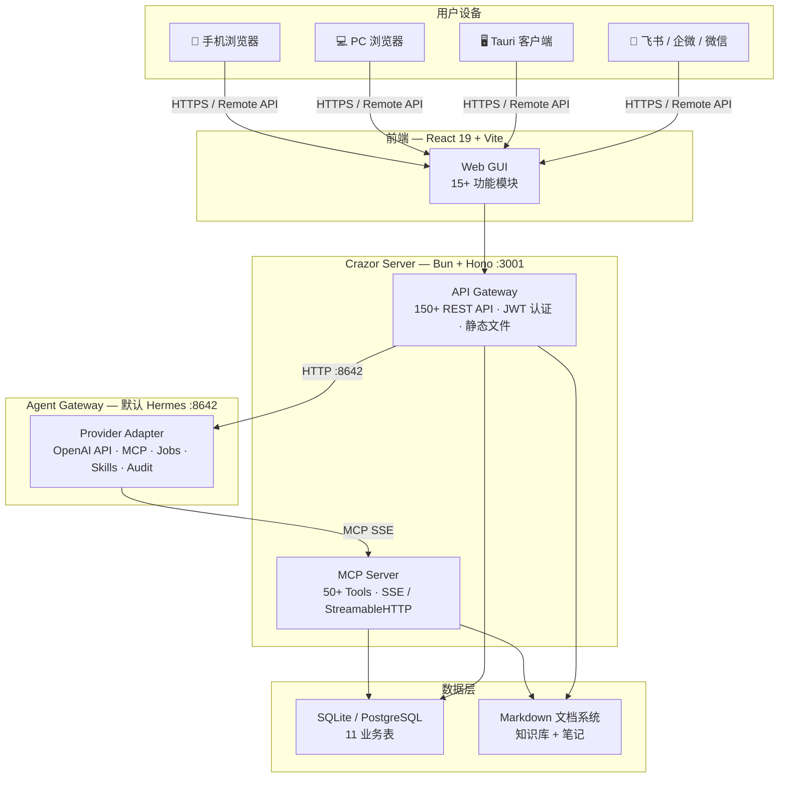

<div align="center">

# Crazor

### 企业 AI 操作系统

**让 AI 数字员工直接操作你的客户、财务、项目、文档**

[功能](#功能) · [架构](#架构) · [快速开始](#快速开始) · [私有化部署](#私有化部署) · [数字员工](#ai-数字员工)

</div>

---

## 项目协作入口

- [AI Native Enterprise OS PRD V2.5](docs/PRD-V2.5.md)
- [V2.5 架构目标基准](docs/architecture/v2.5-target-architecture.md)
- [Docker 部署说明](docs/deployment/docker.md)
- [Hermes Agent 集成说明](docs/deployment/hermes-agent.md)
- [Agent Gateway 解耦规范](docs/architecture/agent-gateway.md)
- [分支与多人协作规范](docs/development/branching-and-collaboration.md)
- [产品持续审计入口](docs/audit/README.md)

## Crazor 是什么

Crazor 是一个开源的企业 AI 操作系统，核心思路：

**AI 数字员工 = Skill + MCP Tool + API + DB + 前端**，一个纵向切片从对话到数据到界面全部打通。

用户在聊天窗口说"新增一个客户张三"，AI 数字员工自动调用 MCP Tool 写入数据库，前端客户列表实时刷新。说"生成本周周报"，自动聚合客户、财务、项目数据并生成 Markdown 报告存入知识库。

底层 AI 能力（模型、Agent、Tool）可替换，企业工作流和数据永久保留。

### 为什么做这个

- 企业用 AI 最大的痛点不是模型不够强，而是 **AI 无法直接操作业务系统**
- 现有的 AI 助手只能聊天，不能帮你录入客户、管理库存、生成报表
- SaaS 平台各自封闭（Google AI 只能用 Google 数据，Salesforce AI 只管 Salesforce）
- 换一个 AI 模型或 Agent，之前搭建的工作流全部作废

Crazor 的解法：自建 MCP Server 统一数据层，AI 数字员工通过标准化接口操作企业数据，与底层模型和 Agent 完全解耦。

---

## 功能

### AI Workspace

| 模块 | 说明 |
|------|------|
| **首页仪表盘** | 今日待办、快捷操作、数据概览、最近会话 |
| **AI 对话** | 流式输出、工具调用可视化、多模型切换、会话历史 |
| **AI 数字员工** | 浏览 21 个数字员工、查看架构详情（MCP/API/DB）、一键安装 |
| **技能清单** | Hermes 技能市场、安装/卸载/更新、多来源（官方/社区/GitHub） |
| **定时任务** | Cron 定时执行 AI 任务、执行日志查看、依赖管理 |
| **消息渠道** | 飞书、企微、微信、WhatsApp、Telegram、Discord、Slack 等 20+ IM |
| **模型配置** | 多模型切换、API Key 管理、辅助模型分配 |
| **Agent 管理** | Hermes 状态监控、配置编辑、内置终端 |

### Enterprise Workspace

| 模块 | 说明 |
|------|------|
| **客户管理** | 联系人 CRUD、客户分层（线索→成交）、跟进时间线、标签体系 |
| **财务中心** | 收支记录、分类统计、月度汇总图表、发票状态追踪 |
| **项目看板** | 看板视图拖拽、任务分解、优先级/截止日期、团队分配 |
| **平台流量** | 内容作品状态追踪、12 个平台筛选、数据回收、看板管理 |
| **知识库** | 文件系统驱动的文档树、Markdown 编辑、全文搜索、Obsidian 兼容 |
| **AI 笔记** | Milkdown WYSIWYG 编辑器、碎片化笔记、聊天消息保存 |
| **数据分析** | 客户/财务/项目多维度聚合、趋势图表 |
| **文件管理** | 文件浏览器、预览、编辑、附件上传 |
| **3D 办公室** | 2.5D 像素风虚拟办公室、员工角色管理 |

### 系统能力

- **多模型切换** — 支持 OpenAI / Claude / Gemini / DeepSeek / GLM / Ollama 等 18+ provider
- **20+ IM 接入** — 飞书、企微、微信、WhatsApp、Telegram、Discord、Slack 等
- **MCP 生态** — 通过 MCP 协议连接任意外部服务（内嵌 50+ Tools）
- **国际化** — 简体中文、English
- **响应式** — 手机/平板/PC 自适应布局
- **桌面客户端** — Tauri 桌面应用，支持 macOS / Windows

---

## 架构

### 系统架构



### 私有化部署架构

```
中央服务器（Crazor 官方）           客户服务器（私有化部署）
┌──────────────────────┐           ┌──────────────────────┐
│ 软件下载              │           │ Docker / 本机部署     │
│ 版本更新 + 安装包      │           │ ┌──────────────────┐ │
│ 微信 OAuth 回调       │           │ │ Crazor Server    │ │
│ (统一 APP_ID)         │           │ │ API + 静态文件    │ │
└──────────────────────┘           │ │ MCP Server       │ │
       │                            │ │ JWT 认证         │ │
       │  Tauri 桌面App             │ └──────────────────┘ │
       ├──────────────────────────→ │ ┌──────────────────┐ │
       │ 检查更新 / OAuth           │ │ Hermes Agent     │ │
       │                            │ │ Gateway + Dashboard│ │
       │                            │ └──────────────────┘ │
       │                            │ ┌──────────────────┐ │
       │                            │ │ SQLite 数据库     │ │
       │                            │ │ 客户数据（完全私有）│ │
       │                            │ └──────────────────┘ │
       │                            └──────────────────────┘
```

### 数据流

```
用户说："新增客户张三，公司是ABC科技"

1. 前端 → Crazor Server → Hermes Gateway API (:8642)
2. Hermes Agent 匹配到"客户管理助手"Skill
3. Agent 调用 MCP Tool: create_contact({name:"张三", company:"ABC科技"})
4. Crazor MCP Server → 写入 SQLite contacts 表
5. 返回结果 → Agent 回复用户
6. 前端客户列表页面自动刷新
```

---

## AI 数字员工

每个数字员工是一个纵向切片，从 Skill 到前端全链路打通：

```
Skill(业务流程指令) → MCP Tool(结构化函数) → REST API(CRUD) → 数据库 → 前端页面
```

### 数字员工与 Hermes Skills 的关系

Crazor 数字员工 **就是 Hermes Skills**，存储在同一个目录下：

```
~/.hermes/skills/                    # Hermes 统一技能目录
├── crazor/                          # Crazor 数字员工（source: crazor 标记）
│   ├── customer-assistant/SKILL.md  # 客户管理助手
│   ├── finance-assistant/SKILL.md   # 财务助手
│   └── ...（共 21 个）
├── hermes-native-skill-1/SKILL.md   # Hermes 原生技能（从市场安装）
└── ...
```

**工作流程**：
1. 源文件定义在 `server/data/skills/*.md`（YAML frontmatter + Markdown）
2. 服务器启动时 `seedSkills()` 自动转换为 Hermes 标准 SKILL.md 格式，写入 `~/.hermes/skills/crazor/`
3. Hermes Agent 扫描 `~/.hermes/skills/` 统一加载所有技能，不区分来源
4. 数字员工 Skill 中声明依赖 `MCP Server: crazor`，调用 Crazor 的 50+ MCP Tools

**前端区分展示**：
- **技能清单页面** — 统一展示所有 Skill（Hermes 原生 + Crazor 数字员工）
- **AI 数字员工页面** — 只展示 Crazor 数字员工的架构详情（MCP/API/DB 全链路）
- **3D 办公室** — 数字员工作为办公室中的可交互角色

### 已实现的数字员工（21 个）

| 数字员工 | 能力 |
|----------|------|
| **客户管理助手** | 线索→跟进→意向→成交/流失，自动分层、跟进提醒 |
| **销售跟进助手** | 销售漏斗管理、成交记录、月度业绩报表 |
| **财务助手** | 收支记录、发票管理、月度汇总、报表生成 |
| **项目助手** | 项目创建、任务分解、看板跟踪、里程碑管理 |
| **内容生产助手** | 多平台内容创作、选题→创作→排版→发布 |
| **素材提炼助手** | 原始素材提取要点、生成结构化知识卡片 |
| **选题排期助手** | 内容日历规划、选题池管理、排期追踪 |
| **朋友圈运营助手** | 朋友圈排期、发布记录、数据复盘、周报 |
| **公众号发布助手** | 公众号内容管理、排版、发布流程 |
| **小红书运营助手** | 小红书内容创作、数据追踪 |
| **人事助手** | 员工档案、考勤、绩效、薪资管理 |
| **库存助手** | SKU 管理、出入库、库存预警 |
| **数据看板** | 周报/月报/KPI 追踪、环比分析 |
| **AI 新闻分析师** | AI 行业新闻追踪、分析报告 |
| **YouTube 运营** | YouTube 内容创作与数据分析 |
| **Twitter 运营** | Twitter 内容发布与互动管理 |
| **Instagram 运营** | Instagram 内容创作与数据分析 |
| **Amazon 运营** | Amazon 跨境电商运营管理 |
| **TikTok 海外运营** | TikTok 海外内容创作与数据追踪 |
| **Shopify 运营** | Shopify 独立站运营管理 |
| **跨境物流助手** | 跨境电商物流管理 |

---

## 技术栈

| 层 | 技术 | 说明 |
|----|------|------|
| **桌面客户端** | Tauri v2 | macOS / Windows 原生壳 |
| **前端框架** | React 19 + Vite 8 | SPA 单页应用 |
| **UI 组件** | shadcn/ui + Radix UI | 可定制组件库 |
| **样式** | Tailwind CSS 4 | 原子化 CSS |
| **Markdown 编辑器** | Milkdown | WYSIWYG，支持数学/代码/Mermaid |
| **图表** | Recharts + Mermaid | 数据可视化 |
| **终端** | xterm.js | 内置终端模拟器 |
| **后端** | Bun + Hono | 高性能 TypeScript 运行时 |
| **MCP Server** | SSE + JSON-RPC 2.0 | 内嵌于后端进程，零额外开销 |
| **AI Agent** | Agent Gateway（默认 Hermes Provider） | 多模型、MCP、技能、记忆、定时任务，可替换 provider |
| **数据库** | SQLite (开发) / PostgreSQL (生产) | 11 张业务表 + users 认证表 |
| **认证** | JWT + 微信 OAuth2 | 微信扫码登录，单人模式 |
| **文档存储** | Markdown 文件系统 | Obsidian 兼容，数字前缀排序 |
| **国际化** | react-i18next | 中文 / English |

---

## 项目结构

```
Crazor/
├── desktop/                        # Tauri 桌面客户端
│   └── src-tauri/
│       ├── tauri.conf.json         # Tauri 配置（窗口、图标、构建）
│       ├── capabilities/           # Tauri v2 权限配置
│       ├── icons/                  # 应用图标（macOS .icns + Windows .ico）
│       └── src/lib.rs              # Rust 入口
│
├── server/                         # 后端 (Bun + Hono + TypeScript)
│   ├── src/
│   │   ├── index.ts                # 入口：150+ API 路由 + MCP + 静态文件
│   │   ├── middleware/
│   │   │   └── auth.ts             # JWT 认证 + 套餐中间件
│   │   └── services/
│   │       ├── crazor-db.ts        # 数据库层：11 表 Schema + CRUD + 聚合统计
│   │       ├── crazor-mcp.ts       # MCP Server：50+ Tools + SSE 传输协议
│   │       ├── crazor-auth.ts      # 认证：微信 OAuth + JWT 签发/验证
│   │       ├── crazor-doc-tree.ts  # 文档树：文件夹 + 笔记管理（文件系统）
│   │       ├── crazor-docs.ts      # 文档读写：内容搜索、附件关联
│   │       ├── crazor-vault-fs.ts  # Vault 文件系统操作
│   │       ├── crazor-config.ts    # 配置：路径、环境变量、套餐
│   │       ├── skill-catalog.ts    # 技能目录：frontmatter 解析、元数据 API
│   │       ├── seed-skills.ts      # 数字员工→Hermes SKILL.md 转换 + 写入
│   │       ├── seed-vault.ts       # 种子数据：初始化知识库目录结构
│   │       ├── migrate-vault.ts    # 迁移：目录重命名（数字前缀）
│   │       └── field-definitions.ts # 自定义字段定义管理
│   └── data/
│       ├── skills/                 # 21 个 Skill 定义（.md + YAML frontmatter）
│       └── vault/                  # 知识库模板和种子数据
│
├── web/                            # 前端 (React 19 + Vite 8)
│   └── src/
│       ├── App.jsx                 # 应用入口：认证状态 + ErrorBoundary
│       ├── AppInner.jsx            # 主应用 Shell：侧边栏 + 路由 + 15+ 视图
│       ├── components/
│       │   ├── LoginDialog.jsx     # 微信扫码登录对话框
│       │   ├── hermes/             # AI 数字员工管理 + 渠道配置
│       │   ├── notebook/           # Milkdown 笔记编辑器组件
│       │   ├── layout/             # 布局组件
│       │   └── ui/                 # shadcn/ui 基础组件
│       ├── pages/
│       │   └── LoginPage.jsx      # 全屏登录页（备用）
│       ├── configs/                # 数据视图配置（CRM、财务、项目、内容等）
│       └── locales/                # 国际化文件（zh / en）
│
├── docker/                         # Docker 镜像与 nginx 反向代理配置
├── docker-compose.yml              # Crazor + 默认 Agent Provider 本地集成部署
├── scripts/hermes                  # Hermes 初始化、启动、备份与密钥轮换脚本
└── docs/                           # 产品文档、部署与协作规范
```

---

## 私有化部署

Crazor 支持四种部署方式，同一套代码通过环境变量切换：

```
┌─────────────────────────────────────────────────────────────────┐
│                        Tauri 桌面安装包                          │
│                   （预写服务器地址，四种都适用）                    │
└──────────┬──────────┬──────────┬──────────┬─────────────────────┘
           │          │          │          │
     方案 A ▼    方案 B ▼    方案 C ▼    方案 D ▼
     ┌────────┐  ┌────────┐  ┌────────┐  ┌────────┐
     │ Docker │  │ Docker │  │ 本机   │  │ 本机   │
     │ Nginx  │  │ Nginx  │  │ Bun    │  │ Bun    │
     │ Crazor │  │ Crazor │  │ Crazor │  │ Crazor │
     │ Hermes │  │        │  │ Hermes │  │        │
     └────────┘  └───┬────┘  └────────┘  └───┬────┘
     一站式          │ 已有Hermes            │ 已有远程
     全容器          │ (环境变量指向)         │ Hermes
                     ▼                       ▼
               已有 Hermes             远程 Hermes
```

### 关键环境变量

| 变量 | 说明 | 默认值 |
|------|------|--------|
| `PORT` | 服务端口 | `3001` |
| `CRAZOR_HOME` | 数据目录 | `~/.crazor` |
| `HERMES_GATEWAY_URL` | Hermes Gateway 地址 | `http://127.0.0.1:8642` |
| `HERMES_DASHBOARD_URL` | Hermes Dashboard 地址 | `http://127.0.0.1:9119` |
| `WECHAT_APP_ID` | 微信开放平台 APP_ID | 空（不启用登录） |
| `WECHAT_APP_SECRET` | 微信开放平台 APP_SECRET | 空 |
| `JWT_SECRET` | JWT 签名密钥 | `dev-secret-change-in-production` |
| `DEPLOYMENT_TIER` | 套餐：`free` / `pro` | `free` |
| `CORS_ORIGINS` | CORS 允许的来源（逗号分隔）；Tauri 客户端需保留 `tauri://localhost` / `https://tauri.localhost` | `http://localhost:5173,http://localhost:5174,tauri://localhost,https://tauri.localhost` |

### 桌面客户端构建

```bash
# 1. 准备图标（1024x1024 PNG）
cp your-icon.png desktop/src-tauri/app-icon.png
cd desktop && npx @tauri-apps/cli icon src-tauri/app-icon.png

# 2. 构建前端
cd web && bun run build

# 3. 构建 Tauri 安装包
cd desktop && npm run tauri build

# 产出：
#   macOS: src-tauri/target/release/bundle/macos/Crazor.app
#          src-tauri/target/release/bundle/dmg/Crazor_1.0.0_aarch64.dmg
#   Windows: src-tauri/target/release/bundle/msi/Crazor_1.0.0_x64.msi
```

---

## MCP Server

Crazor 内嵌 MCP Server，通过 SSE 暴露给 Hermes Agent。无需启动额外进程。

### 55 MCP Tools

**基础 CRUD（联系人/财务/项目/任务/跟进/渠道）：**

| Tools | 说明 |
|-------|------|
| `create/list/get/update_contact` | 联系人操作 |
| `create/list/update_follow_up` | 跟进记录管理 |
| `get_follow_up_reminders` | 跟进提醒 |
| `create/list/update_transaction` | 收支记录操作 |
| `get_finance_stats` | 财务统计（月度/分类） |
| `create/list/update_project` | 项目操作 |
| `create/list/update_task` / `move_task` | 任务操作 + 看板排序 |
| `create/list/update_channel` | 渠道操作 |
| `get_channel_stats` | 渠道统计 |

**CRM 复合操作：**

| Tools | 说明 |
|-------|------|
| `crm_get_client` / `crm_add_client` | 客户查询/新增 |
| `crm_add_followup` / `crm_update_stage` | 跟进/阶段更新 |
| `crm_record_deal` / `crm_list_overdue` | 成交记录/逾期列表 |
| `crm_get_pipeline` / `crm_search` | 销售漏斗/搜索 |

**内容管理：**

| Tools | 说明 |
|-------|------|
| `create/list/get/update/delete_content_piece` | 内容作品 CRUD |
| `get_content_piece_stats` | 内容数据统计 |
| `content_publish` / `content_update_metrics` / `content_check_daily` | 内容发布/更新/检查 |

**文档操作：**

| Tools | 说明 |
|-------|------|
| `create_doc` / `update_doc` / `read_doc` | 文档 CRUD |
| `list_docs` / `search_docs` | 文档列表和全文搜索 |
| `create_folder` | 文件夹创建 |
| `read_vault_file` | 读取知识库文件 |
| `list_notes_by_contact` | 按联系人查询文档 |

**Schema / 统计 / 其他：**

| Tools | 说明 |
|-------|------|
| `list_fields` / `add_field` | 自定义字段管理 |
| `get_contacts_stats` / `get_projects_stats` | 聚合统计 |
| `getbiji_sync` / `getbiji_status` / `getbiji_force_full` | 笔记同步 |

---

## 数据库

12 张表：

| 表 | 用途 |
|----|------|
| `contacts` | 客户 CRM（name, company, stage, source, level, deal, tags） |
| `transactions` | 收支记录（type, amount, category, invoice_number） |
| `projects` | 项目管理（name, status, budget, deadline, team） |
| `tasks` | 看板任务（title, priority, status, assignee, due_date） |
| `follow_ups` | 跟进记录（contact_id, content, follow_up_date） |
| `channels` | 渠道管理（name, type, status, contact_id） |
| `channel_referrals` | 渠道引荐记录 |
| `content_pieces` | 内容作品（title, platform, status, views, likes） |
| `doc_folders` | 文档目录（scope, parent_id, contact_id） |
| `doc_notes` | 文档笔记（scope, folder_id, title） |
| `field_definitions` | 自定义字段定义 |
| `users` | 用户认证（wechat_openid, nickname, avatar_url） |

---

## 快速开始

### 推荐方式：Docker Compose

| 依赖 | 版本 | 安装 |
|------|------|------|
| Docker / OrbStack | 当前可用版本 | macOS 推荐 OrbStack |

### 数据目录

Crazor 的数据独立存储在 `~/.crazor/`：

```
~/.crazor/
├── crazor.db              # 业务数据库（12 张表）
├── vault/
│   ├── knowledge/         # 知识库（文件系统，Obsidian 兼容）
│   │   ├── 00-关于我/
│   │   ├── 10-百科/
│   │   ├── 20-业务流程/
│   │   ├── 30-素材资产/
│   │   ├── 40-事件/
│   │   └── 99-归档/
│   └── notebook/          # AI 笔记
│       └── inbox/
└── skills/                # 已安装的数字员工技能
```

可通过环境变量覆盖：

```bash
CRAZOR_HOME=./data/crazor
AGENT_STATE_HOME=./data/hermes
```

初始化 Hermes 密钥和相对数据目录：

```bash
./scripts/hermes init
```

启动统一入口：

```bash
docker compose up -d --build
```

访问：

```text
http://localhost:5173
http://局域网IP:5173
```

运行交付烟测：

```bash
./scripts/hermes smoke
```

烟测会创建临时客户、文档、附件、渠道、流水、项目、任务、内容、API token 和 agent token，并验证 MCP StreamableHTTP 工具入口，验证后自动清理。需要验证局域网入口时可指定：

```bash
CRAZOR_SMOKE_BASE_URL=http://局域网IP:5173 ./scripts/hermes smoke
```

验证严格认证边界：

```bash
./scripts/hermes smoke-strict
```

该命令会临时开启写入认证和业务只读认证，确认匿名 REST/MCP 写入被拒绝，结束后恢复 Compose 默认后端配置。

### 客户端交付

客户只需要安装 Tauri 桌面客户端。构建客户安装包时，把我们配置好的后端服务地址写入前端包：

```bash
./scripts/build-customer.sh "客户名称" "https://crazor.example.com" macos
```

脚本会使用 `VITE_API_BASE` 构建 Tauri 前端，客户端内所有 `/api/*` 与 `/mcp/*` 请求都会转到该后端服务。
也可以在 GitHub Actions 的“构建客户桌面安装包”工作流中输入客户名称和服务地址，由远端构建机生成安装包 artifact。

Docker 环境会启动：

- `crazor-web`：Web 统一入口，反代 `/api/*` 和 `/mcp/*`。
- `crazor-server`：Bun + Hono 后端，提供业务 API 与 MCP SSE。
- `hermes`：默认 Agent Provider，提供 Agent、模型、技能、记忆和定时任务能力，可通过 `COMPOSE_PROFILES` 解耦。

运行数据统一保存到项目相对目录：

```text
./data/crazor/
./data/hermes/
```

默认不会写入 mock-data，也不会写入内容作品示例记录：

```env
CRAZOR_SEED_DEMO_DATA=false
```

只有明确需要演示数据时才改为 `true`。

需要强制所有业务写入都带可审计身份时开启：

```env
CRAZOR_REQUIRE_WRITE_TOKEN=true
```

开启后，先在“协作审计”里创建身份并签发带 scope 的 API/Agent token，再在“当前访问 Token”里启用；REST 与 MCP 写入会按 token scope 校验，越权动作会进入审计日志。敏感只读接口默认跟随该开关，已有 active token 后，审计日志、成员列表和 token 列表也必须携带有权限的 token。

完整说明见 [Docker 部署说明](docs/deployment/docker.md) 和 [Hermes Agent 集成说明](docs/deployment/hermes-agent.md)。

### 本地开发方式

本地开发才需要直接安装 Bun、Node.js 和 Hermes CLI。

```bash
hermes gateway
cd server
bun install
bun run dev
# Server 运行在 http://localhost:3001
# 同时提供 API + 前端静态文件
# MCP endpoint: http://localhost:3001/mcp/sse
```

### 3. 启动前端（开发模式）

```bash
cd web
npm install
npm run dev
# 前端运行在 http://localhost:5173（带 HMR 热更新）
```

本地开发的 MCP 注册地址：

```bash
# 在 ~/.hermes/config.yaml 中添加：
#   mcp_servers:
#     crazor:
#       url: "http://localhost:3001/mcp/sse"
#       transport: sse
#       enabled: true

hermes mcp test crazor  # 验证连接
```

### 开始使用

打开 http://localhost:5173（开发）或 http://localhost:3001（生产），在对话窗口试试：

- "帮我新增一个客户李四，公司是XYZ科技"
- "看看本月收入多少"
- "创建一个新项目叫海外推广"
- "生成本周周报"

---

## 开发新的数字员工

1. **定义数据库表** — 在 `server/src/services/crazor-db.ts` 添加 CREATE TABLE
2. **实现 REST API** — 在 `server/src/index.ts` 添加 CRUD 路由
3. **注册 MCP Tool** — 在 `server/src/services/crazor-mcp.ts` 添加 tool 定义和 handler
4. **编写 Skill** — 在 `server/data/skills/` 创建 `新助手.md`（含 YAML frontmatter）
5. **更新目录** — 在 `server/src/services/skill-catalog.ts` CATALOG 数组添加条目
6. **开发前端页面** — 在 `web/src/configs/` 创建配置文件，使用 DataView 通用组件

---

## 路线图

- [x] **Phase 1** — MVP：对话 + MCP Server + 数字员工 + 企业数据模块
- [x] **Phase 2** — 知识库文件系统重构、海外平台、3D 办公室
- [x] **Phase 3** — Tauri 桌面客户端、微信登录、私有化部署
- [ ] **Phase 4** — IM Hub（飞书/企微绑定）、技能市场、AI 辅助写作
- [ ] **Phase 5** — 连接器商店（Gmail/Shopify/小红书）、多租户、团队协作

---

## License

MIT
