# **AI Native Enterprise OS（企业 AI 操作系统）PRD（V2.5）**

---

# **1. 项目背景**

当前企业 AI 系统存在严重耦合与割裂问题：

**割裂：**

- AI 模型不断变化（OpenAI、Claude、Gemini、DeepSeek 等）
- Agent 框架快速迭代（Hermes、OpenClaw、Codex、Claude Code 等）
- 企业数据分散在飞书、钉钉、Google Workspace、Salesforce、ERP 等不同系统
- AI 无法获得完整企业上下文
- 企业工作流无法沉淀为长期可复用的 AI 能力

**耦合：**

- AI 能力绑定特定模型
- SaaS 平台数据孤岛严重
- AI 与企业系统深度绑定，迁移成本极高

例如：

- Google AI 只能深度使用 Google Workspace 数据
- Salesforce AI 主要服务 Salesforce CRM
- 不同 AI Agent 之间无法共享工作流与记忆
- 更换 AI 模型或 Agent 后，企业需要重新搭建系统

因此，需要构建：

一个与 AI 模型、Agent、SaaS 平台完全解耦的统一企业 AI Runtime 与 AI 数字员工平台。

---

# **2. 产品定位**

## **产品定义**

一个企业级：

- AI Middleware（AI 中间层）
- Unified Context Layer（统一上下文层）
- AI Employee Runtime（AI 数字员工运行时）
- Enterprise Memory OS（企业记忆系统）

平台。

核心目标：

将企业工作流、上下文、知识库、数据系统与底层 AI 能力彻底解耦，实现统一运行与长期沉淀。

---

# **3. 三大核心**

本系统围绕三个不可分割的核心构建：

---

## **核心一：全局解耦（Decoupled Architecture）**

### **问题**

当前企业 AI 系统严重耦合：

- AI 能力绑定特定模型（Google AI 只能用 Google Workspace 数据）
- SaaS 平台数据孤岛（Salesforce AI 只服务 Salesforce CRM）
- 更换 AI 模型或 Agent 后，企业需要重建整个系统
- 不同 AI Agent 之间无法共享工作流与记忆

### **设计原则**

AI 能力可替换，企业资产不可重建。

未来：

- 模型会变化
- Agent 会变化
- Tool 会变化
- MCP 会变化

但企业核心：

- 数据结构
- 工作流
- 企业记忆
- Context
- GUI
- 数字员工

不依赖任何单一 AI 能力。

### **支持自由切换**

| **层** | **支持** |
|---|---|
| 模型层 | OpenAI、Claude、Gemini、DeepSeek、Ollama、本地模型 |
| Agent 层 | Hermes、OpenClaw、Claude Code、Codex、LangGraph、AutoGen |
| Tool / MCP 层 | MCP Server、Browser、Playwright、RAG、API、Workflow Engine |
| SaaS 系统层 | 飞书、钉钉、Salesforce、Google Workspace、Shopify、ERP |

---

## **核心二：AI 数字员工（AI Employee First）**

### **问题**

当前企业 AI 使用停留在 Chat 层面：

- 每次对话从零开始，无法沉淀
- AI 能力无法封装为可复用的工作单元
- 企业工作流无法转化为长期可运行的 AI 能力

### **设计原则**

系统核心不只是 Chat，而是 AI 数字员工（AI Employee）。

AI 数字员工本质上是一个与底层模型、Agent、Tool 解耦的标准化工作流运行单元，具备长期记忆、工具调用、工作流执行与系统集成能力。

每个数字员工包含：

| **模块** | **说明** |
|---|---|
| Workflow | 工作流 |
| Skill | 专属能力 |
| Tool | 工具调用 |
| MCP | MCP 服务 |
| Memory | 长期记忆 |
| Context | 上下文 |
| Internal API | 内部接口 |
| External API | 外部接口 |
| Knowledge Base | 专属知识库 |
| Permissions | 权限系统 |

### **数字员工可迁移（Runtime Replaceable）**

例如 TikTok 数字员工：

今天运行在 Claude + Hermes，未来可切换为 Gemini + OpenClaw。

无需重建：工作流、Prompt、工具链、数据结构、知识库、上下文。

---

## **核心三：永久企业知识资产库（Enterprise Knowledge Vault）**

### **问题**

企业知识资产当前面临：

- 散落在飞书、钉钉、Google Workspace、Notion 等不同系统
- 数据库中的结构化数据与文档中的非结构化知识割裂
- AI 无法获得完整企业上下文
- 员工离职后，知识随之流失
- 更换工具平台后，历史知识无法迁移

### **设计原则**

企业中真正长期存在的是知识、数据和工作流。AI 可以替换，但企业知识资产必须永久保留且可迁移。

### **双层结构**

本系统通过 **数据库（Database）+ 文档（Markdown）** 双层结构，构建永久的企业知识资产库：

**结构化层（Database）：**

- CRM 数据
- 项目数据
- 任务数据
- 财务数据
- 客户数据
- ERP 数据
- 业务指标

**非结构化层（Markdown 文档）：**

- 企业 SOP
- 会议记录
- 决策文档
- 产品文档
- 知识库文章
- 工作流文档
- 培训材料

### **Everything Is Context**

双层结构中的所有内容——消息、文档、CRM、项目、文件、会议、工作流、数据库——全部统一进入 **Unified Context Layer**，供所有 AI Runtime 使用。

### **企业记忆（Enterprise Memory）**

在永久知识资产库之上，叠加统一企业长期记忆系统：

- Long-term Memory（长期记忆）
- Semantic Memory（语义记忆）
- Workflow Memory（工作流记忆）
- Episodic Memory（情景记忆）
- Knowledge Base（知识库）
- Vector Search（向量检索）

实现：企业知识与 AI Runtime 解耦。AI 可以换，知识不会丢。

---

# **4. AI 数字员工案例**

## **4.1 TikTok Operator**

用户输入：

"帮我发布一条 TikTok 视频"

系统自动执行：

1. 调用 Apify 获取 TikTok 热点
2. 分析热点趋势
3. 读取本地产品知识库
4. 读取飞书产品文档
5. 自动生成脚本
6. 调用视频生成 Tool
7. 自动生成视频
8. 自动生成标题与标签
9. 调用 TikTok API
10. 自动发布到 TikTok Creator 后台

整个流程：

- 无需人工切换系统
- 与模型、Agent、Tool、SaaS 平台全部解耦

---

## **4.2 CRM Operator**

用户输入：

"新增一个客户"

系统自动执行：

1. 读取 CRM 数据结构
2. 自动询问缺失字段
3. 用户补充信息
4. 写入统一数据库
5. 同步 Salesforce
6. 同步钉钉客户系统
7. 创建客户 Workspace
8. 初始化项目上下文
9. 建立后续跟进任务

企业无需关心底层使用 Claude、GPT、Hermes、OpenClaw 还是其他 Agent。

---

# **5. 系统架构**

```mermaid
graph TB
    subgraph GUI["🖥️ GUI Layer · 统一工作台"]
        AI_WS["AI Workspace<br/>Chat · Employees · Skills<br/>MCP · Workflow · Prompt Library<br/>Cron · Logs"]
        ENT_WS["Enterprise Workspace<br/>文档 · 文件 · CRM<br/>项目 · 任务 · 财务 · 看板"]
    end

    subgraph RUNTIME["⚙️ AI Employee Runtime · 核心运行时"]
        WF["Workflow Engine"]
        SK["Skill Runtime"]
        TC["Tool Calling"]
        MC["MCP Runtime"]
        MEM_R["Memory Runtime"]
        AO["Agent Orchestration"]
        CI["Context Injection"]
        EP["Event Processing"]
    end

    subgraph MW["🔌 AI Middleware Layer · 能力解耦"]
        MA["Model Adapter<br/>OpenAI · Claude · Gemini<br/>DeepSeek · Ollama · 本地模型"]
        AA["Agent Adapter<br/>Hermes · OpenClaw · Claude Code<br/>Codex · LangGraph · AutoGen"]
        TA["Tool Adapter<br/>MCP · Browser · Playwright<br/>RAG · API · Workflow Engine"]
        XA["Memory Adapter"]
        CA["Context Adapter"]
    end

    subgraph CTX["🧠 Unified Context Layer · 核心上下文"]
        ECG["Enterprise Context Graph"]
    end

    subgraph MEM["💾 Enterprise Memory OS · 企业记忆"]
        LM["Long-term Memory"]
        SM["Semantic Memory"]
        WM["Workflow Memory"]
        EM["Episodic Memory"]
        KB["Knowledge Base"]
        VS["Vector Search"]
    end

    subgraph CONN["🔗 Connector Layer · 系统接入"]
        IM["IM<br/>飞书 · 钉钉 · Slack"]
        CRM_C["CRM<br/>Salesforce"]
        ERP["ERP<br/>金蝶 · 用友"]
        DOC["文档<br/>Notion · Google Docs"]
        ECOM["电商<br/>Shopify · Amazon"]
        SOCIAL["社媒<br/>TikTok · YouTube · 小红书"]
        DB["数据<br/>PostgreSQL · MySQL"]
    end

    GUI --> RUNTIME
    RUNTIME --> MW
    MW --> CTX
    MW --> MEM
    CTX --> CONN
    MEM --> CTX

    style GUI fill:#4A90D9,color:#fff
    style RUNTIME fill:#E8833A,color:#fff
    style MW fill:#7B68EE,color:#fff
    style CTX fill:#50B86C,color:#fff
    style MEM fill:#D4A843,color:#fff
    style CONN fill:#9B59B6,color:#fff
```

## **5.1 GUI Layer（统一工作台）**

### **AI Workspace**

- Chat
- AI Employees
- Agents
- Skills
- MCP
- Workflow
- Prompt Library
- Cron 定时任务
- Logs

### **Enterprise Workspace**

- 文档系统（类似 Obsidian）
- 文件系统
- CRM
- 项目管理
- 任务管理
- 财务管理
- 数据看板

---

## **5.2 AI Employee Runtime（核心）**

统一数字员工运行时。

负责：

- Workflow Engine
- Workflow Runtime
- Skill Runtime
- Tool Calling
- MCP Runtime
- Memory Runtime
- Agent Orchestration
- Context Injection
- Event Processing

---

## **5.3 AI Middleware Layer（核心）**

统一 AI 中间层。

实现全局能力解耦：

| **模块** | **功能** |
|---|---|
| Model Adapter | 模型适配 |
| Agent Adapter | Agent 适配 |
| Tool Adapter | Tool 适配 |
| MCP Adapter | MCP 适配 |
| Memory Adapter | Memory 适配 |
| Context Adapter | Context 适配 |

---

## **5.4 Connector Layer**

统一企业系统接入层。

支持：

| **类型** | **示例** |
|---|---|
| IM | 飞书、钉钉、Slack |
| CRM | Salesforce |
| ERP | 金蝶、用友 |
| 文档 | Notion、Google Docs |
| 电商 | Shopify、Amazon |
| 社媒 | TikTok、YouTube、小红书 |
| 数据 | PostgreSQL、MySQL |

所有系统统一转换为 **Standardized Context Structure**。

---

## **5.5 Unified Context Layer（核心）**

系统最核心能力。

将企业：

- 消息
- 文档
- 客户
- 项目
- 工作流
- 数据库
- 会议
- 文件
- 行为

统一抽象为 **Enterprise Context Graph**，供所有 AI Runtime 使用。

---

## **5.6 Enterprise Memory OS**

统一企业长期记忆系统。

包括：

- Long-term Memory
- Semantic Memory
- Workflow Memory
- Episodic Memory
- Knowledge Base
- Vector Search

实现：企业记忆与 AI Runtime 解耦。

---

# **6. 技术架构（建议）**

| **模块** | **技术** |
|---|---|
| Frontend | Next.js + React + TypeScript |
| Desktop | Tauri |
| Backend | FastAPI（Python） |
| Database | PostgreSQL |
| Vector DB | pgvector |
| Cache | Redis |
| File Storage | MinIO |
| Search | OpenSearch |
| Event Bus | Kafka / Redis Stream |

---

# **7. MVP 第一阶段**

第一阶段重点：

## **基础解耦能力**

- 多模型切换
- 多 Agent Runtime
- AI Employee Runtime
- Tool Registry
- MCP Registry
- Connector Layer
- Unified Context API
- Enterprise Memory
- Workflow Runtime
- Knowledge Base

---

## **第一批数字员工**

### **TikTok Operator**

支持：

- 热点采集与分析
- 内容生成
- 视频生成
- 自动发布

---

### **CRM Operator**

支持：

- 客户录入
- CRM 同步
- 项目初始化
- 跟进任务创建

---

# **8. 长期目标**

构建：

企业级 AI Runtime Infrastructure

实现：

**企业工作流与 AI 能力彻底解耦。**

最终形成：

- 企业 AI 中间层
- 企业统一上下文层
- 企业数字员工平台
- 企业长期记忆系统
- 企业 AI 操作系统

实现：

One Context For All AI.

---

# 附录：数据架构

> 数据库与知识库的边界划分详见 → [data-architecture.md](./data-architecture.md)
