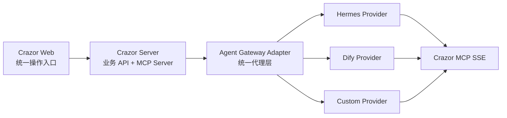

# Agent Gateway 解耦规范

Crazor 的业务系统不能绑定某一个具体 Agent。Hermes Agent 当前只是默认内置 provider，后续可以替换为 Dify、自研 Agent Gateway、OpenHands 类系统，或其他兼容 OpenAI API / MCP 的运行时。

## 分层边界



## 核心原则

- Crazor 的客户、项目、文档、跟进、需求和知识库数据只归 Crazor 管。
- Agent 只通过 API / MCP 操作 Crazor，不直接写 Crazor 业务数据库。
- 服务端统一读取 `AGENT_*` 配置，`HERMES_*` 只作为兼容旧配置存在。
- 前端可以保留 Hermes 相关管理页，但业务入口不能依赖 Hermes 私有概念。
- Provider 私有能力必须封装在 adapter 层，不能散落到业务模块。

## 标准配置

```env
AGENT_PROVIDER=hermes
AGENT_GATEWAY_URL=http://hermes:8642
AGENT_DASHBOARD_URL=http://hermes:9119
AGENT_GATEWAY_API_KEY=change-me-run-scripts-hermes-init
```

兼容旧配置：

```env
HERMES_GATEWAY_URL=http://hermes:8642
HERMES_DASHBOARD_URL=http://hermes:9119
HERMES_API_SERVER_KEY=change-me-run-scripts-hermes-init
```

新代码优先读取 `AGENT_*`，读取不到时才 fallback 到 `HERMES_*`。

## Provider 接入契约

一个新的 Agent Provider 至少需要满足以下能力：

| 能力 | 路径/协议 | 说明 |
|------|-----------|------|
| 对话 | `POST /v1/chat/completions` | 兼容 OpenAI Chat Completions，支持流式输出更好。 |
| Responses | `POST /v1/responses` | 可选。没有时 adapter 需要做降级。 |
| 模型列表 | `GET /v1/models` | 可选。没有时前端展示空状态。 |
| 任务调度 | `/api/jobs/*` | 可选。没有时隐藏或禁用定时任务。 |
| MCP 调用 | SSE / HTTP | Provider 需要能注册并调用 Crazor MCP Server。 |
| 审计 | 会话、消息、工具调用日志 | 最低要求是能被 Crazor 拉取或由 Provider 回传。 |

## 切换外部 Provider

如果不启动内置 Hermes，而是接外部 provider：

```env
COMPOSE_PROFILES=
AGENT_PROVIDER=custom
AGENT_GATEWAY_URL=http://host.docker.internal:8642
AGENT_DASHBOARD_URL=http://host.docker.internal:9119
AGENT_GATEWAY_API_KEY=请替换为真实密钥
```

然后只启动 Crazor：

```bash
docker compose up -d --build crazor-server crazor-web
```

## Hermes Provider 当前实现

当前 Hermes Provider 由 Compose 中的 `hermes` 服务提供，数据目录为：

```text
data/hermes/
├── state/
├── workspaces/
└── backups/
```

Crazor 挂载 provider state，用于同步 Hermes Skills 和读取会话统计；Crazor 不向 `data/hermes/state` 写业务数据。

## 后续演进要求

- 新增 provider 时优先扩展 adapter，不改业务 API。
- 如果 provider 没有 Dashboard，前端应显示“当前 provider 不支持该能力”，不能展示假数据。
- 如果 provider 没有定时任务 API，`/api/cron` 返回空数组，并在前端保持真实空状态。
- 每个 provider 都要有独立部署文档和健康检查说明。
