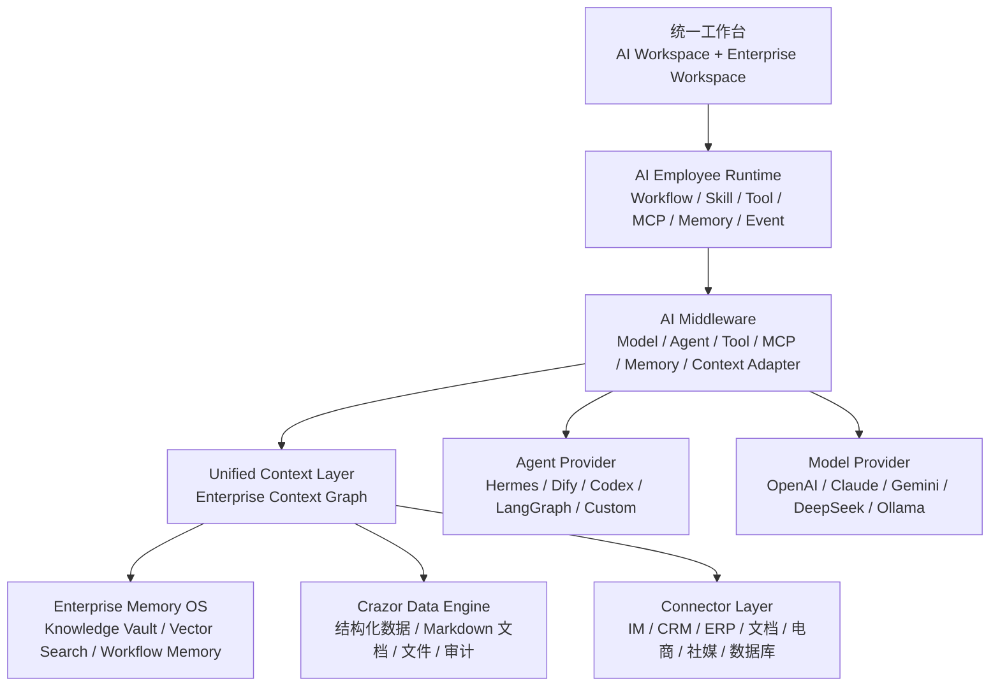

# V2.5 架构目标基准

> 更新日期：2026-06-01
> 状态：新版本架构目标
> 产品源头：[AI Native Enterprise OS PRD V2.5](../PRD-V2.5.md)

## 目标结论

新版本 Crazor 以 PRD V2.5 为架构目标，不再只围绕“Docker 化 Hermes MVP”演进。

核心目标是把 Crazor 建成企业 AI 操作系统：

- 企业数据、知识、工作流和上下文由 Crazor 长期持有。
- 模型、Agent、Tool、MCP 和外部 SaaS 都通过适配层接入，可替换、可审计、可迁移。
- 用户看到的是统一工作台；底层 Agent 和连接器如何协作，不暴露为多入口负担。
- AI 数字员工是标准化运行单元，而不是某个具体 Agent 的私有 Skill。

## 目标分层



## 关键边界

| 层 | 归属 | 约束 |
|----|------|------|
| 统一工作台 | Crazor | 所有业务操作优先在一个入口完成，不把多个子系统入口直接丢给用户。 |
| AI Employee Runtime | Crazor | 数字员工定义、工作流、权限、上下文注入和审计归 Crazor 管。 |
| AI Middleware | Crazor | 模型、Agent、Tool、MCP、Memory 都走 adapter，不把 provider 私有概念写进业务层。 |
| Unified Context Layer | Crazor | 客户、项目、任务、文档、文件、会话、审计事件统一抽象为企业上下文。 |
| Enterprise Memory OS | Crazor | Markdown 知识库、结构化数据、向量检索和工作流记忆共同构成企业记忆。 |
| Connector Layer | Adapter | 飞书、企业微信、CRM、ERP、Notion、Google Docs、Shopify 等都作为连接器接入。 |
| Agent Provider | 可替换 | Hermes 只是当前默认 provider，后续可换 Dify、自研 Gateway 或其他 Agent Runtime。 |

## 数据原则

继续沿用现有数据架构原则：[知识库与数据库边界](../data-architecture.md)。

- 需要筛选、排序、统计、聚合、权限控制的内容进数据库。
- 需要 AI 阅读、理解、创作、沉淀的长文本进 Markdown 知识库。
- 文件、附件、外部素材进入文件层，并通过结构化记录与客户、项目、内容、任务关联。
- 所有写入动作必须进入审计日志，能追踪人类用户、Agent、Token、来源和影响对象。

## 当前 MVP 与 V2.5 的关系

现有 Docker + Hermes 交付仍保留为可靠性验证底座，但它不是新版本架构的终点。

| 当前能力 | V2.5 目标定位 |
|----------|---------------|
| Docker Compose | 内部验证和私有化部署基础。 |
| Hermes Agent | 默认 Agent Provider，不是唯一运行时。 |
| Crazor MCP Server | Tool / MCP Adapter 的第一实现。 |
| SQLite | 开发和小团队部署；生产目标逐步迁移 PostgreSQL。 |
| Markdown Vault | Enterprise Knowledge Vault 的基础实现。 |
| API Token / Agent Token / 审计 | 权限、身份、审计体系的最小底座。 |
| Web 统一入口 | 继续作为主要交互入口，避免多系统跳转。 |

## 第一阶段工程目标

第一阶段不追求一次性完成完整企业版，先把“可替换、可审计、可闭环”的骨架做可靠：

- 统一工作台：客户、需求、项目、任务、文档、文件、Agent 操作和审计都在同一入口完成。
- Agent Gateway：Hermes 接入保持可用，同时抽象出 provider 契约，避免业务层绑定 Hermes。
- AI Employee Runtime：数字员工从“说明文档/Skill 展示”升级为可配置、可执行、可审计的运行单元。
- Unified Context API：为客户、项目、文档、文件、任务、会话、审计事件提供统一上下文读取接口。
- Enterprise Memory：保留 Markdown Vault，补向量检索、上下文索引和工作流记忆。
- Connector Layer：先做连接器注册、凭证、连通性验证、同步任务和审计，不展示假连接状态。
- 权限与审计：从 token scope 扩展到用户、角色、Agent 身份和关键操作审批。
- 交付形态：Docker 私有化可复现，桌面端只作为统一入口壳，不承担业务数据存储。

## 已落地接口

### Tauri / 远程 API 入口兼容

已根据远端 `a058faf feat: Tauri 内嵌前端 + 远程 API 对接` 做安全拆分整合：

- Web 支持 `VITE_API_BASE`，配置后会把同源的 `/api` 和 `/mcp` 请求转发到远程 Crazor API。
- 远程 API 重写先于 Crazor token 注入执行，避免 Tauri 场景下丢失授权头。
- Vite 只在 `mode=tauri` 或 `VITE_TAURI_BUILD=true` 时使用 `base: './'`，默认 Docker Web 仍使用 `/`，避免影响现有 Nginx 入口。
- 服务端默认 CORS 增加 `tauri://localhost` 和 `https://tauri.localhost`。
- 示例配置见 `web/.env.tauri.example`。

完整桌面客户端、微信登录和客户定制安装包仍属于后续独立任务，需要单独验证桌面构建、客户 API 地址注入、OAuth 回调域名和安装包可升级链路。

### `GET /api/crazor/context`

Unified Context Layer 的第一版只读聚合入口，用于让 UI、Agent Runtime 和后续 Memory 索引通过同一个接口读取企业上下文。

查询参数：

| 参数 | 说明 |
|------|------|
| `q` | 可选关键词，匹配客户、项目、任务、内容、文档和审计摘要。 |
| `types` | 可选类型列表，逗号分隔；支持 `contact`、`project`、`task`、`follow_up`、`content_piece`、`channel`、`transaction`、`doc_note`、`audit_log`。 |
| `contact_id` | 可选客户 ID；传入后返回该客户相关的项目、任务、跟进、流水、文档和审计事件。 |
| `limit` | 可选返回数量，范围 1-200，默认 50。 |

返回结构：

```json
{
  "generated_at": "2026-06-01T00:00:00.000Z",
  "filters": {
    "q": "客户关键词",
    "contact_id": "contact-id",
    "types": ["contact", "project", "doc_note"],
    "limit": 50
  },
  "counts": {
    "contact": 1,
    "project": 2
  },
  "items": [
    {
      "type": "contact",
      "id": "contact-id",
      "title": "客户名称",
      "subtitle": "公司名称",
      "summary": "跟进中 / A / 企业培训",
      "status": "跟进中",
      "updated_at": "2026-06-01T00:00:00.000Z",
      "source": "crazor",
      "url": "/contacts/contact-id",
      "relations": {},
      "metadata": {}
    }
  ]
}
```

## 开发约束

- 每次开始新任务前必须先同步远端最新代码，识别是否有新增需求、架构调整或交付修正。
- 发现远端新增需求时，先评估它与 PRD V2.5、当前分支和交付链路的关系，再决定立即整合或拆入后续计划。
- 新功能必须标明归属层级，不能直接把 provider 私有 API 写进业务页面或业务服务。
- UI 只能展示真实可用链路；未接通的能力显示空状态、禁用状态或开发中状态。
- 每条核心业务链路至少包含 UI、API、数据层、审计记录和必要 MCP/Agent 入口。
- 文档以本文件和 PRD V2.5 为目标基准，阶段性验证记录继续写入审计入口。
- 新增部署方案必须说明数据目录、网络入口、健康检查、恢复方式和可执行烟测命令。
