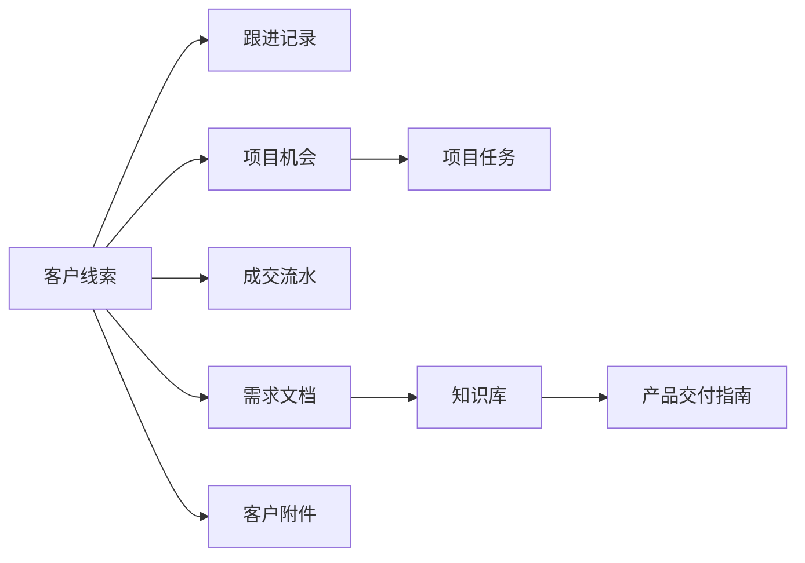

# 客户交付形式可靠性审计

> 更新日期：2026-05-31
> 结论范围：基于当前 `codex/docker-hermes-mvp` 分支和已 fetch 的远程最新代码。

## 结论

当前客户交付形式适合做内部轻量协作和客户演示的最小闭环，不适合作为正式客户交付管理系统直接承诺。

可靠的部分：

- 客户可以进入 CRM，并能关联跟进、需求文档、附件、成交流水、渠道来源、项目机会和项目任务。
- 知识库首启会创建 `20-业务流程/40-产品交付`、`30-素材资产/50-报价方案`、`30-素材资产/60-合同` 等目录。
- `产品交付-填写指南.md`、`交付标准.md`、报价和合同指南能作为交付材料规范入口。
- Agent 可通过 MCP 发现知识库目录，创建文档、创建项目、拆任务、登记成交和读取任务提醒。
- Docker 烟测覆盖客户、文档、附件、成交、项目、任务和 Agent MCP 写入链路。

不可靠的部分：

- 没有独立的“交付单 / 交付项目 / 验收单”业务实体，交付状态目前散落在项目、任务、交易和 Markdown 文档里。
- 项目表缺少交付类型、交付阶段、验收状态、客户负责人、内部负责人、里程碑、交付物清单、交付风险和签收时间等结构化字段。
- 任务只有 `todo / doing / done`，无法表达交付里程碑、客户验收、返工、阻塞、依赖和版本交付。
- 成交流水的回款进度没有和项目交付状态、验收状态形成强关联。
- 附件目前挂在客户下，不挂在项目或交付节点下，后续查找合同、验收材料、培训资料和交付包会混在一起。
- 没有客户可查看的交付视图、导出包、报价单/合同生成、验收确认和交付归档动作。
- 交付权限仍是业务域级 token，不是客户级、项目级或交付级权限。

## 当前链路

这条链路能证明“客户从线索到项目任务”的内部协作闭环，但还不能证明“客户交付物从约定到验收”的正式闭环。

## 建议优先级

P0：不要把当前形态包装成正式客户交付系统。演示时应表述为“客户交付协作 MVP”。

P1：新增交付记录实体，最少包含 `contact_id`、`project_id`、`delivery_type`、`stage`、`owner`、`start_date`、`due_date`、`acceptance_status`、`deliverables`、`risks`、`handover_doc_id`。

P1：从客户成交后一键生成交付记录，并自动生成交付计划文档，默认写入 `20-业务流程/40-产品交付`。

P1：附件支持挂到项目或交付记录，区分需求材料、合同、课件、交付包、验收材料。

P2：项目任务增加里程碑和阻塞原因，任务完成不等于客户验收。

P2：补客户级 / 项目级 / 交付级权限，避免多人协作时跨客户误读。

## 可演示边界

可以演示：

- 客户录入、跟进、需求文档、附件归档。
- 成交登记后生成项目机会。
- 项目拆任务，Agent 读取任务提醒。
- 知识库里维护交付标准、报价和合同指南。

暂不建议演示为已完成：

- 客户验收和签收。
- 交付包归档和客户侧查看。
- 合同 / 报价单自动生成。
- 项目交付阶段和回款联动。
- 客户级权限隔离。
