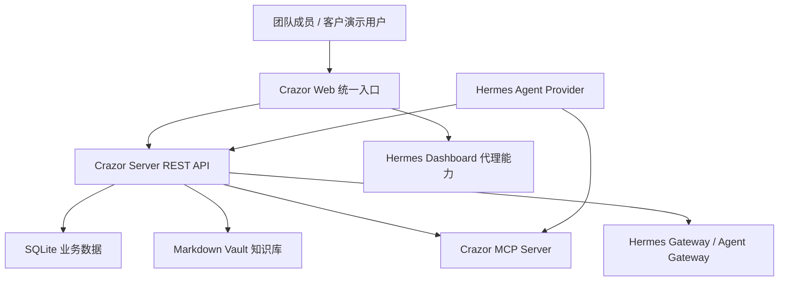
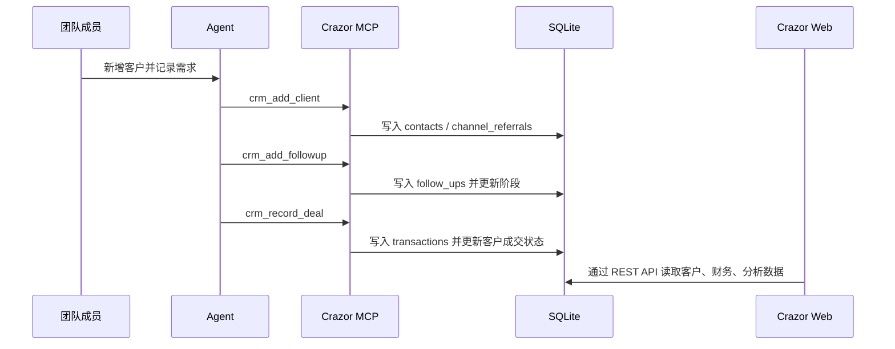
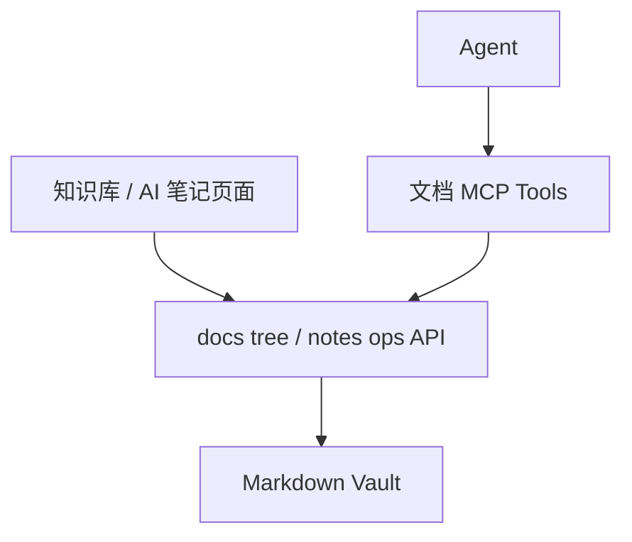

# 产品功能地图

> 本文记录“产品实际功能关系”，不是愿景说明。判断标准是：页面、API、数据层、MCP/Agent 入口是否能共同支撑一个真实操作链路。

## 总体关系

## 一级模块清单

| 模块 | 前端入口 | 后端/API | 数据层 | MCP/Agent 能力 | 当前完整性 |
|------|----------|----------|--------|----------------|------------|
| 首页仪表盘 | `home` | 聚合多个 API | DB + Hermes 会话统计 | 间接依赖 | 可展示，需继续核验指标来源 |
| AI 对话 | `sessions` / chat | `/api/sessions`、`/api/responses`、`/api/chat/completions` | Hermes 会话 + Crazor 会话代理 | Hermes Gateway + MCP | 基础可用 |
| 模型配置 | `tasks` / 模型配置页 | `/api/model/info`、`/api/model/set`、`/api/env` | Hermes 配置 | Provider 私有能力 | 可用，但 Hermes 耦合明显 |
| 技能市场 | `hermes-skills` | `/api/skills`、`/api/skills/market` | Hermes skills state | Hermes Skills | 已修复大响应风险，基础可用 |
| 定时任务 | `cron` | `/api/cron/*` | Hermes jobs | Hermes jobs | 可用性依赖 Hermes |
| 记忆管理 | `hermes-memory` / `memory` | `/api/memories` | Hermes memory | Hermes memory | 可用性依赖 Hermes |
| Agent 管理 | `hermes-agents` | `/api/agents`、`/api/status` | Provider state | Hermes provider | 监控型页面为主 |
| 客户管理 | `contacts` | `/api/crazor/contacts`、`/api/crazor/follow-ups` | `contacts`、`follow_ups`、`channel_referrals` | CRM MCP tools | 后端/MCP 较完整，UI 写入闭环缺失 |
| 渠道管理 | `channels` | `/api/crazor/channels` | `channels`、`channel_referrals` | 渠道 MCP tools | 后端/MCP 较完整，UI 新增/编辑缺失 |
| 财务中心 | `finance` | `/api/crazor/transactions`、`/api/crazor/analytics/*` | `transactions` | 财务 MCP tools | 后端可写，UI 新增入口缺失 |
| 项目看板 | `projects` | `/api/crazor/projects`、`/api/crazor/tasks` | `projects`、`tasks` | 项目/任务 MCP tools | 任务看板可拖拽，项目创建/任务创建 UI 不完整 |
| 平台流量 | `content` | `/api/crazor/content-pieces` | `content_pieces` | 内容 MCP tools | 后端/MCP 可用，UI 新增/编辑缺失 |
| 知识库 | `knowledge` | `/api/crazor/docs/knowledge/*` | Markdown Vault | 文档 MCP tools | 可读写，已补旧路径和空白文档兜底 |
| AI 笔记 | `notebook` | `/api/crazor/docs/notebook/*` | Markdown Vault | 文档 MCP tools | 可读写，编辑体验需持续核验 |
| 文件管理 | `files` | `/api/files/*` | Hermes workspace files | Provider 文件能力 | 依赖 workspace 配置 |
| 终端 | `terminal` | `/api/terminal/sessions/*` | Hermes workspace | Provider 终端能力 | 可用性依赖 Hermes |
| 工作区 | 侧边栏工作区 | `/api/workspaces/*` | Hermes/Crazor 配置 | 影响文件、终端、会话 | 基础可用，需要权限和隔离策略 |
| 数据分析 | `analytics` | `/api/crazor/analytics/*` | 聚合 DB | 间接依赖 | 可展示，需补业务指标定义 |
| 集成 | `integrations` | 待核验 | 待核验 | 待核验 | 需要继续审计 |
| 3D 办公室 | `office` | 前端状态为主 | 本地状态 | 暂无关键业务闭环 | 演示型能力 |

## 核心业务链路

### 客户线索到成交

当前判断：Agent 写入链路相对完整，前端读取链路存在；但前端直接新增客户、记录跟进、登记成交的操作闭环不足。

### 内容生产到数据回收

当前判断：数据边界清楚，后端和 MCP 有记录与指标更新能力；UI 目前偏展示与拖拽，新增作品、关联正文、回收数据的人类操作链路不足。

### 知识库与文档协作

当前判断：文件系统驱动的知识库可用，旧路径兼容和缺失文档兜底已补。下一步要审计“客户关联文档、内容正文 doc_id、搜索结果跳转、附件归档”的完整体验。

## 数据边界

| 数据类型 | 应进入 DB | 应进入 Markdown Vault |
|----------|-----------|-----------------------|
| 客户姓名、阶段、来源、预算、成交金额 | 是 | 否 |
| 客户背景长文、访谈纪要、复盘 | 可存摘要 | 是 |
| 跟进记录日期、方式、下一步 | 是 | 重要长文可同步 |
| 交易金额、回款状态、发票状态 | 是 | 否 |
| 项目状态、任务、负责人、截止日期 | 是 | 项目方案正文可进文档 |
| 内容标题、平台、状态、数据指标 | 是 | 正文、脚本、素材进入文档 |
| SOP、话术、培训材料 | 否 | 是 |

## 接口可用性快照

本轮只做只读烟测，不写入正式业务数据：

| API | 状态 | 说明 |
|-----|------|------|
| `/api/health` | 200 | Crazor Server 健康 |
| `/api/status` | 200 | Hermes 状态代理 |
| `/api/model/info` | 200 | 当前模型配置可读 |
| `/api/skills` | 200 | 已安装技能可读 |
| `/api/skills/market` | 200 | 已降为轻量响应 |
| `/api/crazor/contacts` | 200 | 当前为空数组 |
| `/api/crazor/content-pieces` | 200 | 有内容记录 |
| `/api/crazor/transactions` | 200 | 当前为空数组 |
| `/api/crazor/projects` | 200 | 当前为空数组 |
| `/api/crazor/tasks` | 200 | 当前为空数组 |
| `/api/crazor/channels` | 200 | 当前为空数组 |
| `/api/crazor/analytics/overview` | 200 | 聚合接口可读 |
| `/api/crazor/docs/knowledge/tree` | 200 | 知识库树可读 |
| `/api/workspaces` | 200 | 工作区可读 |
| `/api/sessions` | 200 | 会话列表可读 |
