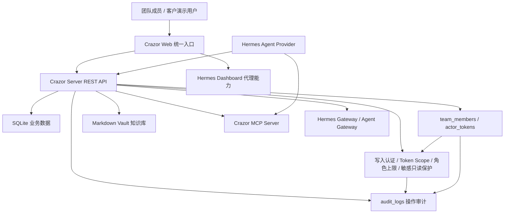
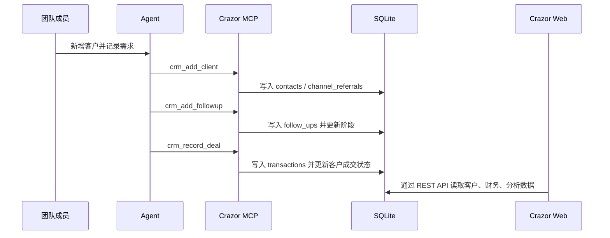
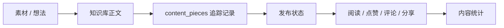
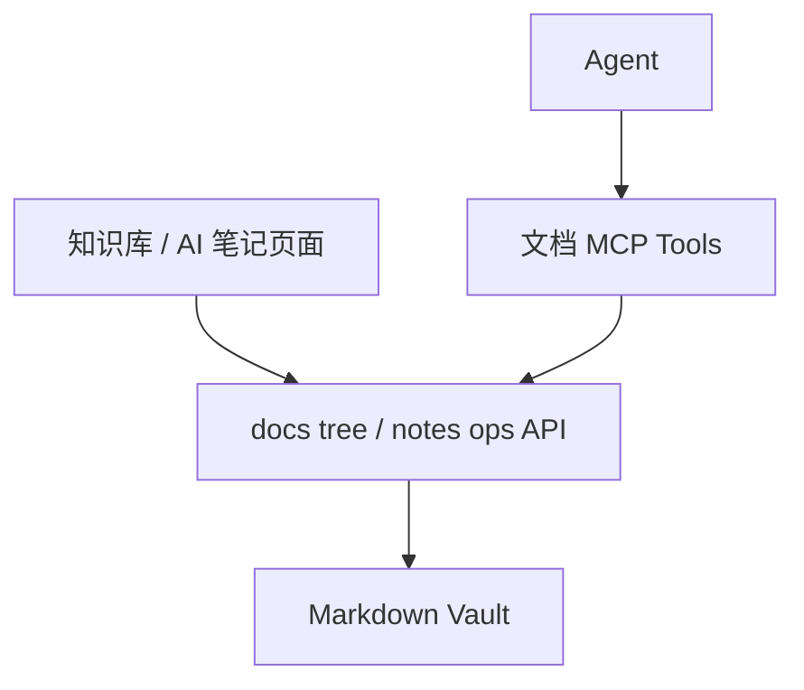

# 产品功能地图

> 本文记录“产品实际功能关系”，不是愿景说明。判断标准是：页面、API、数据层、MCP/Agent 入口是否能共同支撑一个真实操作链路。

## 总体关系

## 一级模块清单

| 模块 | 前端入口 | 后端/API | 数据层 | MCP/Agent 能力 | 当前完整性 |
|------|----------|----------|--------|----------------|------------|
| 首页仪表盘 | `home` | 聚合多个 API | DB + Hermes 会话统计 | 间接依赖 | 可展示，需继续核验指标来源 |
| AI 对话 | `sessions` / chat | `/api/sessions`、`/api/responses`、`/api/chat/completions` | Hermes 会话 + Crazor 会话代理 | Hermes Gateway + MCP | 基础可用 |
| 模型配置 | `tasks` / 模型配置页 | `/api/model/info`、`/api/model/set`、`/api/env` | Hermes 配置 | Provider 私有能力 | 可用，但 Hermes 耦合明显 |
| 技能市场 | `hermes-skills` | `/api/skills`、`/api/skills/market` | Hermes skills state | Hermes Skills | 已修复大响应风险，基础可用 |
| 定时任务 | `cron` | `/api/cron/*` | Hermes jobs | Hermes jobs | 可用性依赖 Hermes |
| 记忆管理 | `hermes-memory` / `memory` | `/api/memories` | Hermes memory | Hermes memory | 可用性依赖 Hermes |
| Agent 管理 | `hermes-agents` | `/api/agents`、`/api/status` | Provider state | Hermes provider | 监控型页面为主 |
| 客户管理 | `contacts` | `/api/crazor/contacts`、`/api/crazor/follow-ups`、`/api/crazor/follow-up-reminders`、`/api/crazor/contacts/:id/docs`、`/api/crazor/contacts/:id/docs/search`、`/api/crazor/attachments/policy`、`/api/crazor/contacts/:id/attachments`、`/api/crazor/contacts/:id/attachments/:filename/preview`、`/api/crazor/docs/knowledge/notes-ops`、`/api/crazor/transactions`、`/api/crazor/channels/:id/referrals`、`/api/crazor/projects`、`/api/crazor/tasks?contact_id=:id` | `contacts`、`follow_ups`、`transactions`、Markdown Vault、`attachments/contacts`、`channel_referrals`、`projects`、`tasks` | CRM MCP tools + 文档 MCP tools + 渠道/项目/任务 MCP tools | 客户详情深链路、待跟进提醒处理、项目任务联动、文档搜索跳转、附件归档、附件策略和文本/图片预览可用；跨模块提醒规则和客户级权限待补 |
| 渠道管理 | `channels` | `/api/crazor/channels` | `channels`、`channel_referrals` | 渠道 MCP tools | 渠道新增/编辑/删除基础闭环可用；客户侧转介绍关系已接入，渠道侧批量运营待补 |
| 财务中心 | `finance` | `/api/crazor/transactions`、`/api/crazor/analytics/*` | `transactions` | 财务 MCP tools | 流水新增可用，API 更新/删除通过；编辑入口需按财务权限继续评估 |
| 项目看板 | `projects` | `/api/crazor/projects`、`/api/crazor/tasks` | `projects`、`tasks` | 项目/任务 MCP tools | 项目创建、任务创建、任务拖拽/删除可用；项目编辑归档待补 |
| 平台流量 | `content` | `/api/crazor/content-pieces`、`/api/crazor/docs/knowledge/notes`、`/api/crazor/docs/knowledge/notes-ops` | `content_pieces`、Markdown Vault | 内容 MCP tools + 文档 MCP tools | 内容作品新增/编辑/删除与正文创建/打开/保存可用；内容复盘和搜索跳转待补 |
| 知识库 | `knowledge` | `/api/crazor/docs/knowledge/*` | Markdown Vault | 文档 MCP tools | 可读写，已补旧路径和空白文档兜底 |
| AI 笔记 | `notebook` | `/api/crazor/docs/notebook/*` | Markdown Vault | 文档 MCP tools | 可读写，编辑体验需持续核验 |
| 文件管理 | `files` | `/api/files/*` | Hermes workspace files | Provider 文件能力 | 依赖 workspace 配置 |
| 终端 | `terminal` | `/api/terminal/sessions/*` | Hermes workspace | Provider 终端能力 | 可用性依赖 Hermes |
| 工作区 | 侧边栏工作区 | `/api/workspaces/*` | Hermes/Crazor 配置 | 影响文件、终端、会话 | 基础可用，需要权限和隔离策略 |
| 团队身份与接入凭证 | `teamops` 协作审计 | `/api/crazor/identity/me`、`/api/crazor/identity/members`、`/api/crazor/identity/tokens` | `team_members`、`actor_tokens.scopes` | REST/MCP 可通过 token 派生 actor，校验 scope，并受角色写入/敏感读取上限约束 | 最小 UI 与 API 可用；当前访问 token、token scope、强制写入认证、角色级写入上限和敏感只读保护已接入，完整登录态、审批和细粒度 RBAC 待补 |
| 操作审计 | `teamops` 协作审计 | `/api/crazor/audit-logs` | `audit_logs` | MCP 写入、无 token、scope 越权、角色越权和敏感读取拒绝自动记录 | REST/MCP 写入、`missing-token deny_*`、scope/角色越权 `deny_*`、敏感读取 `deny_read` 审计可用；审批流待补 |
| 数据分析 | `analytics` | `/api/crazor/analytics/*` | 聚合 DB | 间接依赖 | 可展示，需补业务指标定义 |
| 集成 | `integrations` | 待核验 | 待核验 | 待核验 | 需要继续审计 |
| 3D 办公室 | `office` | 前端状态为主 | 本地状态 | 暂无关键业务闭环 | 演示型能力 |

## 核心业务链路

### 客户线索到成交

当前判断：Agent 写入链路相对完整，前端客户基础新增/编辑已接入，客户详情已能直接记录跟进、完成/顺延待跟进提醒、登记成交、沉淀并编辑客户需求文档，搜索客户文档正文，按策略归档客户附件并预览文本/图片，且可建立渠道转介绍、从客户生成项目机会、从项目拆解任务。下一步要补跨模块提醒规则、附件扫描和客户级权限边界。

### 内容生产到数据回收

当前判断：数据边界清楚，后端和 MCP 有记录与指标更新能力；UI 已补内容作品新增/编辑，也能从详情创建正文、回填 `doc_id`、打开并保存知识库正文。下一步要补内容搜索结果跳转、发布复盘模板和指标回收体验。

### 知识库与文档协作

当前判断：文件系统驱动的知识库可用，旧路径兼容和缺失文档兜底已补，客户关联文档创建、读回、打开编辑、按客户搜索跳转已验证，客户附件文本/图片预览已验证，内容正文 `doc_id` 打开与保存链路已验证。下一步要审计跨模块搜索结果跳转、更多格式预览和知识库权限策略。

## 数据边界

| 数据类型 | 应进入 DB | 应进入 Markdown Vault |
|----------|-----------|-----------------------|
| 客户姓名、阶段、来源、预算、成交金额 | 是 | 否 |
| 客户背景长文、访谈纪要、复盘 | 可存摘要 | 是 |
| 跟进记录日期、方式、下一步 | 是 | 重要长文可同步 |
| 客户附件文件、合同、课件、访谈录音 | 元数据可进 DB，当前用文件系统列表 | 原文件进入 `CRAZOR_HOME/attachments/contacts/:id` |
| 交易金额、回款状态、发票状态 | 是 | 否 |
| 项目状态、任务、负责人、截止日期 | 是 | 项目方案正文可进文档 |
| 内容标题、平台、状态、数据指标 | 是 | 正文、脚本、素材进入文档 |
| SOP、话术、培训材料 | 否 | 是 |
| 操作者、来源、动作、实体、payload hash | 是，进入 `audit_logs` | 否 |
| 团队成员、agent 身份、角色、状态 | 是，进入 `team_members` | 否 |
| API token、agent token | 是，只保存 SHA-256 hash、前缀和 scopes | 否 |

## 接口可用性快照

本轮同时完成只读接口和临时写入烟测；临时写入数据已删除，不进入正式业务数据：

| API | 状态 | 说明 |
|-----|------|------|
| `/api/health` | 200 | Crazor Server 健康 |
| `/api/status` | 200 | Hermes 状态代理 |
| `/api/model/info` | 200 | 当前模型配置可读 |
| `/api/skills` | 200 | 已安装技能可读 |
| `/api/skills/market` | 200 | 已降为轻量响应 |
| `/api/crazor/contacts` | 200 | 当前为空数组 |
| `/api/crazor/content-pieces` | 200 | 有内容记录 |
| `/api/crazor/transactions` | 200 | 当前为空数组 |
| `/api/crazor/projects` | 200 | 当前为空数组 |
| `/api/crazor/tasks` | 200 | 当前为空数组 |
| `/api/crazor/channels` | 200 | 当前为空数组 |
| `/api/crazor/analytics/overview` | 200 | 聚合接口可读 |
| `/api/crazor/audit-logs` | 200 | 默认可读；严格模式已有 active token 后需要有权限 token |
| `/api/crazor/identity/me` | 200 | 可从 token 派生当前 actor |
| `/api/crazor/identity/members` | 200 | 团队成员 API 可读写；严格模式已有 active token 后列表需要有权限 token |
| `/api/crazor/identity/tokens` | 200 | actor token API 可读写，明文 token 只在创建时返回，可配置 scopes；严格模式已有 active token 后列表需要有权限 token |
| `POST /mcp` | 200 | MCP StreamableHTTP 统一入口可用，返回 `Mcp-Session-Id` |
| `/api/crazor/docs/knowledge/tree` | 200 | 知识库树可读 |
| `/api/workspaces` | 200 | 工作区可读 |
| `/api/sessions` | 200 | 会话列表可读 |

## 写入接口快照

| 对象 | API | 烟测结果 | 说明 |
|------|-----|----------|------|
| 客户 | `/api/crazor/contacts` | 通过 | 创建、更新、删除 |
| 渠道 | `/api/crazor/channels` | 通过 | 创建、更新、删除 |
| 财务流水 | `/api/crazor/transactions` | 通过 | 创建、更新、删除 |
| 内容作品 | `/api/crazor/content-pieces` | 通过 | 创建、更新、删除 |
| 项目 | `/api/crazor/projects` | 通过 | 创建、更新、删除 |
| 任务 | `/api/crazor/tasks` | 通过 | 创建、更新、删除 |
| 客户跟进 | `/api/crazor/follow-ups` | 通过 | 创建并在客户详情读回 |
| 客户待跟进提醒处理 | `/api/crazor/follow-up-reminders` + `/api/crazor/follow-ups/:id` | 通过 | 客户详情和数据分析页可完成或顺延今日到期/逾期提醒，更新进入 `follow_up` 审计 |
| 客户需求文档 | `/api/crazor/contacts/:id/docs` | 通过 | 创建并从客户文档列表读回 |
| 客户文档编辑 | `/api/crazor/docs/knowledge/notes-ops` | 通过 | 从客户详情打开、保存并读回正文 |
| 客户成交 | `/api/crazor/transactions` + `/api/crazor/contacts/:id` | 通过 | 创建流水并回写客户阶段/金额 |
| 客户渠道转介绍 | `/api/crazor/channels/:id/referrals` + `/api/crazor/contacts/:id/channels` | 通过 | 从客户详情建立关系并从客户侧读回 |
| 客户生成项目机会 | `/api/crazor/projects` | 通过 | 项目记录保持 `contact_id` 关联 |
| 客户项目任务联动 | `/api/crazor/tasks` + `/api/crazor/tasks?contact_id=:id` | 通过 | 从客户项目拆解任务，并按客户读回关联项目下任务 |
| 客户文档搜索跳转 | `/api/crazor/contacts/:id/docs/search` + `/api/crazor/docs/knowledge/notes-ops` | 通过 | 客户详情可搜索需求文档正文，并直接打开编辑结果 |
| 客户附件归档 | `/api/crazor/contacts/:id/attachments` | 通过 | 客户详情可上传、列表、下载、删除附件，并记录 `contact_attachment` 审计 |
| 客户附件策略与预览 | `/api/crazor/attachments/policy` + `/api/crazor/contacts/:id/attachments/:filename/preview` | 通过 | 可配置扩展名/大小限制，文本和图片可在客户详情预览，非法类型与超大文件被拒绝 |
| 内容正文关联 | `/api/crazor/content-pieces` + `/api/crazor/docs/knowledge/notes-ops` | 通过 | 内容详情可创建正文、回填 `doc_id`、打开和保存正文 |
| 团队成员 | `/api/crazor/identity/members` | 通过 | 创建、查询、删除临时成员 |
| actor token | `/api/crazor/identity/tokens` | 通过 | 创建、查询、撤销临时 token |
| REST token scope | `/api/crazor/*` + `/api/crazor/audit-logs` | 通过 | `contact:create` token 可创建客户，创建项目被 403 拒绝并记录 `deny_create` |
| MCP token scope | `POST /mcp` + `/api/crazor/audit-logs` | 通过 | `contact:create` agent token 可调 `create_contact`，调 `create_project` 返回 `isError=true` 并记录 `deny_create` |
| 强制写入认证 | `CRAZOR_REQUIRE_WRITE_TOKEN=true` + `/api/crazor/*` + `POST /mcp` | 通过 | 无 token REST/MCP 写入被拒绝，有效 token 放行，缺 token 与越权动作进入审计 |
| 角色级 RBAC | `/api/crazor/*` + `POST /mcp` + `/api/crazor/audit-logs` | 通过 | admin 可写全部；member 被限制在业务域；viewer 不可写；agent 降级后已签发 token 的 MCP 写入被拒绝 |
| 敏感只读保护 | `CRAZOR_REQUIRE_WRITE_TOKEN=true` + `/api/crazor/audit-logs` + `/api/crazor/identity/*` | 通过 | 无 token/无效 token/非 admin 读取敏感接口被拒绝；拒绝记录 `deny_read`；普通业务只读保持可读 |
| 协作审计页面 | `teamops` | 通过 | 侧边栏入口、身份列表、当前访问 token、token 列表、审计日志查看 |
| REST 操作审计 | `/api/crazor/audit-logs` | 通过 | API token 写入记录 actor/source/action/entity/payload_hash |
| MCP SSE 操作审计 | `/mcp/sse` + `/api/crazor/audit-logs` | 通过 | Agent token 工具写入记录 actor/source/action/entity/payload_hash |
| MCP StreamableHTTP 操作审计 | `POST /mcp` + `/api/crazor/audit-logs` | 通过 | Agent token 工具写入记录 actor/source/action/entity/payload_hash |
